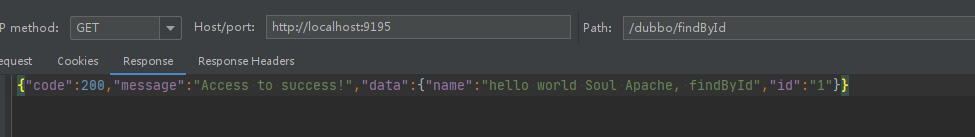
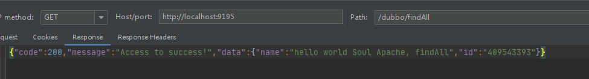
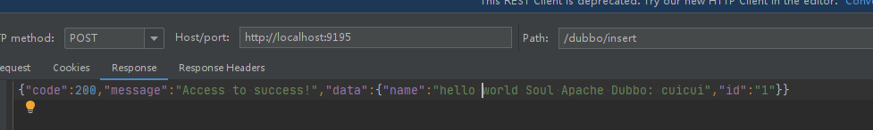
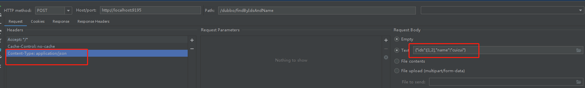
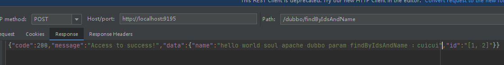
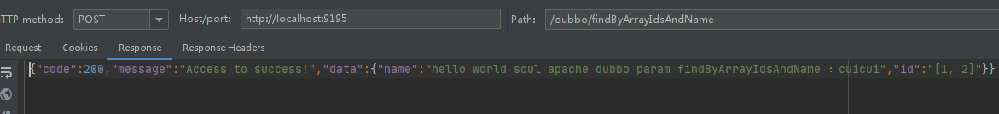
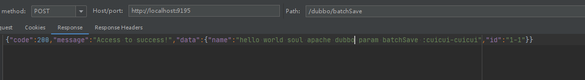
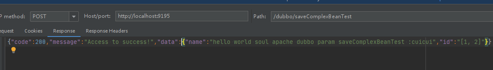

soul 作为流行的网关应用，对接的系统各种各样，当然少不了dubbo。那么soul是如何对接dubbo应用的呢？那么，我们就先跑个例子看看。

* 首先我们先启动soul网关和admin管理端

```log
2021-01-15 20:11:58.565  INFO 2644 --- [           main] o.d.s.w.configuration.SoulConfiguration  : load plugin:[alibaba-dubbo-body-param] [org.dromara.soul.plugin.alibaba.dubbo.param.BodyParamPlugin]
2021-01-15 20:11:58.565  INFO 2644 --- [           main] o.d.s.w.configuration.SoulConfiguration  : load plugin:[dubbo] [org.dromara.soul.plugin.alibaba.dubbo.AlibabaDubboPlugin]
2021-01-15 20:11:58.565  INFO 2644 --- [           main] o.d.s.w.configuration.SoulConfiguration  : load plugin:[monitor] [org.dromara.soul.plugin.monitor.MonitorPlugin]
2021-01-15 20:11:58.565  INFO 2644 --- [           main] o.d.s.w.configuration.SoulConfiguration  : load plugin:[response] [org.dromara.soul.plugin.httpclient.response.WebClientResponsePlugin]
2021-01-15 20:11:58.565  INFO 2644 --- [           main] o.d.s.w.configuration.SoulConfiguration  : load plugin:[response] [org.dromara.soul.plugin.alibaba.dubbo.response.DubboResponsePlugin]
2021-01-15 20:11:58.783  INFO 2644 --- [           main] b.s.s.d.w.WebsocketSyncDataConfiguration : you use websocket sync soul data.......
2021-01-15 20:11:58.965  INFO 2644 --- [           main] o.d.s.p.s.d.w.WebsocketSyncDataService   : websocket connection is successful.....
2021-01-15 20:11:59.125  INFO 2644 --- [           main] o.s.b.a.e.web.EndpointLinksResolver      : Exposing 2 endpoint(s) beneath base path '/actuator'
2021-01-15 20:12:00.178  INFO 2644 --- [           main] o.s.b.web.embedded.netty.NettyWebServer  : Netty started on port(s): 9195
2021-01-15 20:12:00.182  INFO 2644 --- [           main] o.d.s.b.SoulBootstrapApplication         : Started SoulBootstrapApplication in 8.658 seconds (JVM running for 10.543)
```

```log
2021-01-15 20:10:15.679  INFO 9984 --- [           main] .d.s.w.r.o.CachingOperationNameGenerator : Generating unique operation named: batchEnabledUsingPOST_1
2021-01-15 20:10:15.694  INFO 9984 --- [           main] .d.s.w.r.o.CachingOperationNameGenerator : Generating unique operation named: syncDataUsingPOST_1
2021-01-15 20:10:15.725  INFO 9984 --- [           main] .d.s.w.r.o.CachingOperationNameGenerator : Generating unique operation named: detailRuleUsingGET_1
2021-01-15 20:10:15.741  INFO 9984 --- [           main] .d.s.w.r.o.CachingOperationNameGenerator : Generating unique operation named: batchEnabledUsingPOST_2
2021-01-15 20:10:15.741  INFO 9984 --- [           main] .d.s.w.r.o.CachingOperationNameGenerator : Generating unique operation named: detailUsingGET_1
2021-01-15 20:10:15.804  INFO 9984 --- [           main] o.s.b.w.embedded.tomcat.TomcatWebServer  : Tomcat started on port(s): 9095 (http) with context path ''
2021-01-15 20:10:15.944  INFO 9984 --- [           main] o.dromara.soul.admin.SoulAdminBootstrap  : Started SoulAdminBootstrap in 8.925 seconds (JVM running for 12.176)
2021-01-15 20:10:16.291  INFO 9984 --- [)-192.168.1.107] o.a.c.c.C.[Tomcat].[localhost].[/]       : Initializing Spring DispatcherServlet 'dispatcherServlet'
2021-01-15 20:10:16.291  INFO 9984 --- [)-192.168.1.107] o.s.web.servlet.DispatcherServlet        : Initializing Servlet 'dispatcherServlet'
2021-01-15 20:10:16.306  INFO 9984 --- [)-192.168.1.107] o.s.web.servlet.DispatcherServlet        : Completed initialization in 15 ms
2021-01-15 20:11:58.968  INFO 9984 --- [0.0-9095-exec-1] o.d.s.a.l.websocket.WebsocketCollector   : websocket on open successful....
```

看到如上日志输出，说明网关和管理端已经正常启动。

* 接下来导入源码中的dubbo例子，soul-examples-apache-dubbo-service，查看dubbo配置，那我们就懂了，用的是zookeeper做为注册中心，并暴露了两个服务类。

```xml
<beans xmlns="http://www.springframework.org/schema/beans"
       xmlns:xsi="http://www.w3.org/2001/XMLSchema-instance"
       xmlns:dubbo="http://code.alibabatech.com/schema/dubbo"
       xsi:schemaLocation="http://www.springframework.org/schema/beans
       http://www.springframework.org/schema/beans/spring-beans.xsd
       http://code.alibabatech.com/schema/dubbo
       http://code.alibabatech.com/schema/dubbo/dubbo.xsd">

    <dubbo:application name="test-dubbo-service"/>

    <dubbo:registry address="zookeeper://localhost:2181"/>

    <dubbo:protocol name="dubbo" port="20888"/>

    <dubbo:service timeout="10000" interface="org.dromara.soul.examples.dubbo.api.service.DubboTestService" ref="dubboTestService"/>
    <dubbo:service timeout="10000" interface="org.dromara.soul.examples.dubbo.api.service.DubboMultiParamService" ref="dubboMultiParamService"/>
</beans>
```

* 那么我们就先启动zookeeper

```log
2021-01-15 20:15:20,391 [myid:] - INFO  [main:ZKDatabase@152] - zookeeper.commitLogCount=500
2021-01-15 20:15:20,415 [myid:] - INFO  [main:SnapStream@61] - zookeeper.snapshot.compression.method = CHECKED
2021-01-15 20:15:20,447 [myid:] - INFO  [main:FileSnap@85] - Reading snapshot ..\data\version-2\snapshot.7
2021-01-15 20:15:20,466 [myid:] - INFO  [main:DataTree@1730] - The digest in the snapshot has digest version of 2, , with zxid as 0x7, and digest value as 1371985504
2021-01-15 20:15:20,539 [myid:] - INFO  [main:ZKAuditProvider@42] - ZooKeeper audit is disabled.
2021-01-15 20:15:20,544 [myid:] - INFO  [main:FileTxnSnapLog@363] - 74 txns loaded in 25 ms
2021-01-15 20:15:20,545 [myid:] - INFO  [main:ZKDatabase@289] - Snapshot loaded in 153 ms, highest zxid is 0x51, digest is 8209265874
2021-01-15 20:15:20,547 [myid:] - INFO  [main:FileTxnSnapLog@470] - Snapshotting: 0x51 to ..\data\version-2\snapshot.51
2021-01-15 20:15:20,549 [myid:] - INFO  [main:ZooKeeperServer@529] - Snapshot taken in 2 ms
2021-01-15 20:15:20,571 [myid:] - INFO  [ProcessThread(sid:0 cport:2181)::PrepRequestProcessor@136] - PrepRequestProcessor (sid:0) started, reconfigEnabled=false
2021-01-15 20:15:20,572 [myid:] - INFO  [main:RequestThrottler@74] - zookeeper.request_throttler.shutdownTimeout = 10000
2021-01-15 20:15:20,594 [myid:] - INFO  [main:ContainerManager@83] - Using checkIntervalMs=60000 maxPerMinute=10000 maxNeverUsedIntervalMs=0
```

* 看到如上日志说明zookeeper已经起来了。接下来就直接运行这个dubbo应用

```log
2021-01-15 20:25:13.230  INFO 5380 --- [ain-EventThread] o.a.c.f.state.ConnectionStateManager     : State change: CONNECTED
2021-01-15 20:25:13.252  INFO 5380 --- [ain-EventThread] o.a.c.framework.imps.EnsembleTracker     : New config event received: {}
2021-01-15 20:25:13.252  INFO 5380 --- [ain-EventThread] o.a.c.framework.imps.EnsembleTracker     : New config event received: {}
2021-01-15 20:25:14.876  INFO 5380 --- [           main] o.s.b.w.embedded.tomcat.TomcatWebServer  : Tomcat started on port(s): 8011 (http) with context path ''
2021-01-15 20:25:14.883  INFO 5380 --- [           main] o.d.s.e.a.d.s.TestApacheDubboApplication : Started TestApacheDubboApplication in 6.832 seconds (JVM running for 9.537)
2021-01-15 20:25:15.236  INFO 5380 --- [pool-2-thread-1] o.d.s.client.common.utils.RegisterUtils  : dubbo client register success: {"appName":"dubbo","contextPath":"/dubbo","path":"/dubbo/findAll","pathDesc":"Get all data","rpcType":"dubbo","serviceName":"org.dromara.soul.examples.dubbo.api.service.DubboTestService","methodName":"findAll","ruleName":"/dubbo/findAll","parameterTypes":"","rpcExt":"{\"group\":\"\",\"version\":\"\",\"loadbalance\":\"random\",\"retries\":2,\"timeout\":10000,\"url\":\"\"}","enabled":true} 
2021-01-15 20:25:15.257  INFO 5380 --- [pool-2-thread-1] o.d.s.client.common.utils.RegisterUtils  : dubbo client register success: {"appName":"dubbo","contextPath":"/dubbo","path":"/dubbo/insert","pathDesc":"Insert a row of data","rpcType":"dubbo","serviceName":"org.dromara.soul.examples.dubbo.api.service.DubboTestService","methodName":"insert","ruleName":"/dubbo/insert","parameterTypes":"org.dromara.soul.examples.dubbo.api.entity.DubboTest","rpcExt":"{\"group\":\"\",\"version\":\"\",\"loadbalance\":\"random\",\"retries\":2,\"timeout\":10000,\"url\":\"\"}","enabled":true} 
2021-01-15 20:25:15.272  INFO 5380 --- [pool-2-thread-1] o.d.s.client.common.utils.RegisterUtils  : dubbo client register success: {"appName":"dubbo","contextPath":"/dubbo","path":"/dubbo/findById","pathDesc":"Query by Id","rpcType":"dubbo","serviceName":"org.dromara.soul.examples.dubbo.api.service.DubboTestService","methodName":"findById","ruleName":"/dubbo/findById","parameterTypes":"java.lang.String","rpcExt":"{\"group\":\"\",\"version\":\"\",\"loadbalance\":\"random\",\"retries\":2,\"timeout\":10000,\"url\":\"\"}","enabled":true} 
2021-01-15 20:25:15.286  INFO 5380 --- [pool-2-thread-1] o.d.s.client.common.utils.RegisterUtils  : dubbo client register success: {"appName":"dubbo","contextPath":"/dubbo","path":"/dubbo/findByIdsAndName","pathDesc":"","rpcType":"dubbo","serviceName":"org.dromara.soul.examples.dubbo.api.service.DubboMultiParamService","methodName":"findByIdsAndName","ruleName":"/dubbo/findByIdsAndName","parameterTypes":"java.util.List,java.lang.String","rpcExt":"{\"group\":\"\",\"version\":\"\",\"loadbalance\":\"random\",\"retries\":2,\"timeout\":10000,\"url\":\"\"}","enabled":true} 
2021-01-15 20:25:15.299  INFO 5380 --- [pool-2-thread-1] o.d.s.client.common.utils.RegisterUtils  : dubbo client register success: {"appName":"dubbo","contextPath":"/dubbo","path":"/dubbo/findByListId","pathDesc":"","rpcType":"dubbo","serviceName":"org.dromara.soul.examples.dubbo.api.service.DubboMultiParamService","methodName":"findByListId","ruleName":"/dubbo/findByListId","parameterTypes":"java.util.List","rpcExt":"{\"group\":\"\",\"version\":\"\",\"loadbalance\":\"random\",\"retries\":2,\"timeout\":10000,\"url\":\"\"}","enabled":true} 
2021-01-15 20:25:15.317  INFO 5380 --- [pool-2-thread-1] o.d.s.client.common.utils.RegisterUtils  : dubbo client register success: {"appName":"dubbo","contextPath":"/dubbo","path":"/dubbo/batchSave","pathDesc":"","rpcType":"dubbo","serviceName":"org.dromara.soul.examples.dubbo.api.service.DubboMultiParamService","methodName":"batchSave","ruleName":"/dubbo/batchSave","parameterTypes":"java.util.List","rpcExt":"{\"group\":\"\",\"version\":\"\",\"loadbalance\":\"random\",\"retries\":2,\"timeout\":10000,\"url\":\"\"}","enabled":true} 
2021-01-15 20:25:15.332  INFO 5380 --- [pool-2-thread-1] o.d.s.client.common.utils.RegisterUtils  : dubbo client register success: {"appName":"dubbo","contextPath":"/dubbo","path":"/dubbo/findByStringArray","pathDesc":"","rpcType":"dubbo","serviceName":"org.dromara.soul.examples.dubbo.api.service.DubboMultiParamService","methodName":"findByStringArray","ruleName":"/dubbo/findByStringArray","parameterTypes":"[Ljava.lang.String;","rpcExt":"{\"group\":\"\",\"version\":\"\",\"loadbalance\":\"random\",\"retries\":2,\"timeout\":10000,\"url\":\"\"}","enabled":true} 
2021-01-15 20:25:15.347  INFO 5380 --- [pool-2-thread-1] o.d.s.client.common.utils.RegisterUtils  : dubbo client register success: {"appName":"dubbo","contextPath":"/dubbo","path":"/dubbo/findByArrayIdsAndName","pathDesc":"","rpcType":"dubbo","serviceName":"org.dromara.soul.examples.dubbo.api.service.DubboMultiParamService","methodName":"findByArrayIdsAndName","ruleName":"/dubbo/findByArrayIdsAndName","parameterTypes":"[Ljava.lang.Integer;,java.lang.String","rpcExt":"{\"group\":\"\",\"version\":\"\",\"loadbalance\":\"random\",\"retries\":2,\"timeout\":10000,\"url\":\"\"}","enabled":true} 
2021-01-15 20:25:15.361  INFO 5380 --- [pool-2-thread-1] o.d.s.client.common.utils.RegisterUtils  : dubbo client register success: {"appName":"dubbo","contextPath":"/dubbo","path":"/dubbo/saveComplexBeanTest","pathDesc":"","rpcType":"dubbo","serviceName":"org.dromara.soul.examples.dubbo.api.service.DubboMultiParamService","methodName":"saveComplexBeanTest","ruleName":"/dubbo/saveComplexBeanTest","parameterTypes":"org.dromara.soul.examples.dubbo.api.entity.ComplexBeanTest","rpcExt":"{\"group\":\"\",\"version\":\"\",\"loadbalance\":\"random\",\"retries\":2,\"timeout\":10000,\"url\":\"\"}","enabled":true} 
2021-01-15 20:25:15.375  INFO 5380 --- [pool-2-thread-1] o.d.s.client.common.utils.RegisterUtils  : dubbo client register success: {"appName":"dubbo","contextPath":"/dubbo","path":"/dubbo/saveComplexBeanTestAndName","pathDesc":"","rpcType":"dubbo","serviceName":"org.dromara.soul.examples.dubbo.api.service.DubboMultiParamService","methodName":"saveComplexBeanTestAndName","ruleName":"/dubbo/saveComplexBeanTestAndName","parameterTypes":"org.dromara.soul.examples.dubbo.api.entity.ComplexBeanTest,java.lang.String","rpcExt":"{\"group\":\"\",\"version\":\"\",\"loadbalance\":\"random\",\"retries\":2,\"timeout\":10000,\"url\":\"\"}","enabled":true} 
2021-01-15 20:25:15.390  INFO 5380 --- [pool-2-thread-1] o.d.s.client.common.utils.RegisterUtils  : dubbo client register success: {"appName":"dubbo","contextPath":"/dubbo","path":"/dubbo/batchSaveAndNameAndId","pathDesc":"","rpcType":"dubbo","serviceName":"org.dromara.soul.examples.dubbo.api.service.DubboMultiParamService","methodName":"batchSaveAndNameAndId","ruleName":"/dubbo/batchSaveAndNameAndId","parameterTypes":"java.util.List,java.lang.String,java.lang.String","rpcExt":"{\"group\":\"\",\"version\":\"\",\"loadbalance\":\"random\",\"retries\":2,\"timeout\":10000,\"url\":\"\"}","enabled":true} 

```

看到如上日志，dubbo就成功发布到了网关中。好，那么我们就来试试效果如何。

* 小试牛刀

无参接口调用

```java
    @Override
    @SoulDubboClient(path = "/findById", desc = "Query by Id")
    public DubboTest findById(final String id) {
        DubboTest dubboTest = new DubboTest();
        dubboTest.setId(id);
        dubboTest.setName("hello world Soul Apache, findById");
        return dubboTest;
    }

```



```java
@Override
    @SoulDubboClient(path = "/findAll", desc = "Get all data")
    public DubboTest findAll() {
        DubboTest dubboTest = new DubboTest();
        dubboTest.setName("hello world Soul Apache, findAll");
        dubboTest.setId(String.valueOf(new Random().nextInt()));
        return dubboTest;
    }

```



有参接口

```java
    @Override
    @SoulDubboClient(path = "/insert", desc = "Insert a row of data")
    public DubboTest insert(final DubboTest dubboTest) {
        dubboTest.setName("hello world Soul Apache Dubbo: " + dubboTest.getName());
        return dubboTest;
    }
```

参数：

```json
{"ids":[1,2],"name":"cuicui"}
```



多参接口

```java
    @Override
    @SoulDubboClient(path = "/findByIdsAndName")
    public DubboTest findByIdsAndName(List<Integer> ids, String name) {
        DubboTest test = new DubboTest();
        test.setId(ids.toString());
        test.setName("hello world soul apache dubbo param findByIdsAndName ：" + name);
        return test;
    }
```





多参接口：

```java
    @Override
    @SoulDubboClient(path = "/findByArrayIdsAndName")
    public DubboTest findByArrayIdsAndName(Integer[] ids, String name) {
        DubboTest test = new DubboTest();
        test.setId(Arrays.toString(ids));
        test.setName("hello world soul apache dubbo param findByArrayIdsAndName ：" + name);
        return test;
    }

```

参数：

```json
{"ids":[1,2],"name":"cuicui"}
```



集合对象参数接口：

```java
    @Override
    @SoulDubboClient(path = "/batchSave")
    public DubboTest batchSave(List<DubboTest> dubboTestList) {
        DubboTest test = new DubboTest();
        test.setId(dubboTestList.stream().map(DubboTest::getId).collect(Collectors.joining("-")));
        test.setName("hello world soul apache dubbo param batchSave :" + dubboTestList.stream().map(DubboTest::getName).collect(Collectors.joining("-")));
        return test;
    }
```

参数：

```json
{"dubboTestList":[{"id":"1","name":"cuicui"},{"id":"1","name":"cuicui"}]}
```

响应：



复杂对象参数接口：

```
    @Override
    @SoulDubboClient(path = "/saveComplexBeanTest")
    public DubboTest saveComplexBeanTest(ComplexBeanTest complexBeanTest) {
        DubboTest test = new DubboTest();
        test.setId(complexBeanTest.getIdLists().toString());
        test.setName("hello world soul apache dubbo param saveComplexBeanTest :" + complexBeanTest.getDubboTest().getName());
        return test;
    }
```

参数：

```json
{"dubboTest":{"id":"1","name":"cuicui"},"idLists":["1","2"],"idMaps":{"id":1,"name":"cuicui"}}
```

响应：



常用的传参方式都用了一遍，轻松无压力。只需使用http post方式，把json参数通过body传输，通过网关即可轻松访问dubbo服务。

**好了，总结一下：**

1. **dubbo应用如何使用soul网关**

* 引入soul依赖

```xml
       <dependency>
            <groupId>org.dromara</groupId>
            <artifactId>soul-spring-boot-starter-client-apache-dubbo</artifactId>
            <version>${soul.version}</version>
        </dependency>
```

* 配置soul-admin地址、contextPath、应用名称

```yaml
soul:
  dubbo:
    adminUrl: http://localhost:9095
    contextPath: /dubbo
    appName: dubbo
```

* 需要发布到soul的接口上增加注解@SoulDubboClient并配置映射路径

```
@SoulDubboClient(path = "/findById", desc = "Query by Id")
```

**2.dubbo服务通过soul网关进行调用**

发送http post请求，body传输json参数

**遇到的问题：**

调用有参接口而未传入参数响应错误信息

```log
{"code":431,"message":"Dubbo must have body param, please enter the JSON format in the body!","data":null}
```

未开启dubbo插件调用接口响应错误信息

```log
{"code":-103,"message":"Service invocation exception, or no result is returned!","data":null}
```