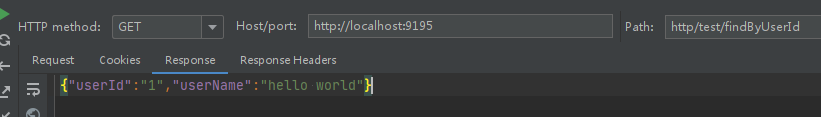

* fork soul仓库[https://github.com/dromara/soul](https://github.com/dromara/soul)
* 导入idea后直接打包安装，可跳过文档和测试用例

```bash
mvn clean package install -Dmaven.test.skip=true -Dmaven.javadoc.skip=true -Drat.skip=true -Dcheckstyle.skip=true
```

* 启动网关soul-boostrap，运行SoulAdminBootstrap后可打开http://localhost:9095/进行管理


* 启动管理端soul-admin，运行SoulAdminBootstrap

* 导入soul-example,运行soul-examples-http里的SoulTestHttpApplication
* 测试通过网关访问soul-examples-http的接口



* 至此，基于http方式来使用soul网关就已经正常使用了。