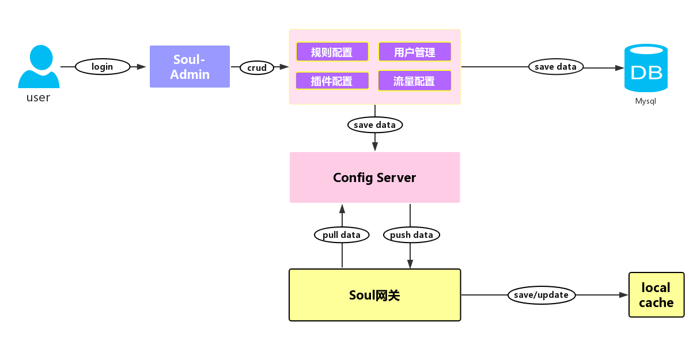

## soul数据同步

数据同步是指将 `soul-admin` 配置的数据，同步到 `soul` 集群中的JVM内存里面，当请求到来后只需从本地获取配置信息即可，这是网关高性能的关键。为了这种高性能，就需要维护网关本地内存中的配置与admin的配置保持同步。

## soul数据同步的原理

`Soul` 数据同步的流程，`Soul` 网关在启动时，会从从配置服务同步配置数据，并且支持推拉模式获取配置变更信息，并且更新本地缓存。而管理员在管理后台，变更用户、规则、插件、流量配置，通过推拉模式将变更信息同步给 `Soul` 网关，具体是 `push` 模式，还是 `pull` 模式取决于配置。关于配置同步模块，其实是一个简版的配置中心。



## http长轮询原理

Soul 借鉴了 `Apollo`、`Nacos` 的设计思想，取其精华，自己实现了 `http` 长轮询数据同步功能。注意，这里并非传统的 ajax 长轮询！


http 长轮询机制如上所示，soul-web 网关请求 admin 的配置服务，读取超时时间为 90s，意味着网关层请求配置服务最多会等待 90s，这样便于 admin 配置服务及时响应变更数据，从而实现准实时推送。

http 请求到达 sou-admin 之后，并非立马响应数据，而是利用 Servlet3.0 的异步机制，异步响应数据。首先，将长轮询请求任务 `LongPollingClient` 扔到 `BlocingQueue` 中，并且开启调度任务，60s 后执行，这样做的目的是 60s 后将该长轮询请求移除队列，即便是这段时间内没有发生配置数据变更。因为即便是没有配置变更，也得让网关知道，总不能让其干等吧，而且网关请求配置服务时，也有 90s 的超时时间。如果这段时间内，管理员变更了配置数据，此时，会挨个移除队列中的长轮询请求，并响应数据，告知是哪个 Group 的数据发生了变更。网关收到响应信息之后，只知道是哪个 Group 发生了配置变更，还需要再次请求该 Group 的配置数据。为什么不是直接将变更的数据写出？因为 http 长轮询机制只能保证准实时，如果在网关层处理不及时，或者管理员频繁更新配置，很有可能便错过了某个配置变更的推送，安全起见，只告知某个 Group 信息发生了变更。

## http长轮询流程

* 打开admin http数据同步开关

```xml
soul:
  sync:
      http:
        enabled: true
```

* 也相应打开网关中http数据同步的开关

```xml
soul:
    sync:
        http:
             url: http://localhost:9095
```

* admin这端主要是HttpLongPollingDataChangedListener，该类是http长轮询的核心类,具体负责调度网关长轮询任务，缓存的刷新和推送变更通知以及响应配置数据。

```java
@Configuration
public class DataSyncConfiguration {

    /**
     * http long polling(default strategy).
     */
    @Configuration
    @ConditionalOnProperty(name = "soul.sync.http.enabled", havingValue = "true")
    @EnableConfigurationProperties(HttpSyncProperties.class)
    static class HttpLongPollingListener {

        @Bean
        @ConditionalOnMissingBean(HttpLongPollingDataChangedListener.class)
        public HttpLongPollingDataChangedListener httpLongPollingDataChangedListener(final HttpSyncProperties httpSyncProperties) {
            return new HttpLongPollingDataChangedListener(httpSyncProperties);
        }

    }
}
```

网关启动的时候注册HttpSyncDataService服务，然后在构造方法中调用了start方法开始到admin拉取数据。

```java
 private void start() {
        // It could be initialized multiple times, so you need to control that.
        if (RUNNING.compareAndSet(false, true)) {
            // fetch all group configs.
            this.fetchGroupConfig(ConfigGroupEnum.values());
            int threadSize = serverList.size();
            this.executor = new ThreadPoolExecutor(threadSize, threadSize, 60L, TimeUnit.SECONDS,
                    new LinkedBlockingQueue<>(),
                    SoulThreadFactory.create("http-long-polling", true));
            // start long polling, each server creates a thread to listen for changes.
            this.serverList.forEach(server -> this.executor.execute(new HttpLongPollingTask(server)));
        } else {
            log.info("soul http long polling was started, executor=[{}]", executor);
        }
    }
```

start方法主要干两件事，第一件事是在配置的一堆admin服务器循环去调用admin的/configs/fetch接口拉取全量的数据，如果拉取到了数据，则中断循环。如果循环结束还未拉取到，那么网关就没法启动了。没有配置的网关启动也毫无意义。拉取到配置数据后挨个组去判断数据的md5以及修改时间，如果md5不同且修改时间比本地配置数据修改时间更晚，说明配置需要更新则刷新本地缓存。否则都无变化则等待30s。

```
 private void fetchGroupConfig(final ConfigGroupEnum... groups) throws SoulException {
        for (int index = 0; index < this.serverList.size(); index++) {
            String server = serverList.get(index);
            try {
                this.doFetchGroupConfig(server, groups);
                break;
            } catch (SoulException e) {
                // no available server, throw exception.
                if (index >= serverList.size() - 1) {
                    throw e;
                }
                log.warn("fetch config fail, try another one: {}", serverList.get(index + 1));
            }
        }
    }

    private void doFetchGroupConfig(final String server, final ConfigGroupEnum... groups) {
        StringBuilder params = new StringBuilder();
        for (ConfigGroupEnum groupKey : groups) {
            params.append("groupKeys").append("=").append(groupKey.name()).append("&");
        }
        String url = server + "/configs/fetch?" + StringUtils.removeEnd(params.toString(), "&");
        log.info("request configs: [{}]", url);
        String json = null;
        try {
            json = this.httpClient.getForObject(url, String.class);
        } catch (RestClientException e) {
            String message = String.format("fetch config fail from server[%s], %s", url, e.getMessage());
            log.warn(message);
            throw new SoulException(message, e);
        }
        // update local cache
        boolean updated = this.updateCacheWithJson(json);
        if (updated) {
            log.info("get latest configs: [{}]", json);
            return;
        }
        // not updated. it is likely that the current config server has not been updated yet. wait a moment.
        log.info("The config of the server[{}] has not been updated or is out of date. Wait for 30s to listen for changes again.", server);
        ThreadUtils.sleep(TimeUnit.SECONDS, 30);
    }
```

第二件事就是往线程池中提交和admin服务数量相同的长轮询任务,一直调用doLongPolling方法去监听admin数据变化。具体就是调用admin端的/configs/listener接口。一旦admin有数据变更则会响应回来，当收到具体哪些组数据变更后，则调用doFetchGroupConfig真正去拉取变化组的配置数据。

```java
  class HttpLongPollingTask implements Runnable {

        private String server;

        private final int retryTimes = 3;

        HttpLongPollingTask(final String server) {
            this.server = server;
        }

        @Override
        public void run() {
            while (RUNNING.get()) {
                for (int time = 1; time <= retryTimes; time++) {
                    try {
                        doLongPolling(server);
                    } catch (Exception e) {
                        // print warnning log.
                        if (time < retryTimes) {
                            log.warn("Long polling failed, tried {} times, {} times left, will be suspended for a while! {}",
                                    time, retryTimes - time, e.getMessage());
                            ThreadUtils.sleep(TimeUnit.SECONDS, 5);
                            continue;
                        }
                        // print error, then suspended for a while.
                        log.error("Long polling failed, try again after 5 minutes!", e);
                        ThreadUtils.sleep(TimeUnit.MINUTES, 5);
                    }
                }
            }
            log.warn("Stop http long polling.");
        }
    }
```

```java
    private void doLongPolling(final String server) {
        MultiValueMap<String, String> params = new LinkedMultiValueMap<>(8);
        for (ConfigGroupEnum group : ConfigGroupEnum.values()) {
            ConfigData<?> cacheConfig = factory.cacheConfigData(group);
            String value = String.join(",", cacheConfig.getMd5(), String.valueOf(cacheConfig.getLastModifyTime()));
            params.put(group.name(), Lists.newArrayList(value));
        }
        HttpHeaders headers = new HttpHeaders();
        headers.setContentType(MediaType.APPLICATION_FORM_URLENCODED);
        HttpEntity httpEntity = new HttpEntity(params, headers);
        String listenerUrl = server + "/configs/listener";
        log.debug("request listener configs: [{}]", listenerUrl);
        JsonArray groupJson = null;
        try {
            String json = this.httpClient.postForEntity(listenerUrl, httpEntity, String.class).getBody();
            log.debug("listener result: [{}]", json);
            groupJson = GSON.fromJson(json, JsonObject.class).getAsJsonArray("data");
        } catch (RestClientException e) {
            String message = String.format("listener configs fail, server:[%s], %s", server, e.getMessage());
            throw new SoulException(message, e);
        }
        if (groupJson != null) {
            // fetch group configuration async.
            ConfigGroupEnum[] changedGroups = GSON.fromJson(groupJson, ConfigGroupEnum[].class);
            if (ArrayUtils.isNotEmpty(changedGroups)) {
                log.info("Group config changed: {}", Arrays.toString(changedGroups));
                this.doFetchGroupConfig(server, changedGroups);
            }
        }
    }
```

网关的主动拉取数据和监听具体到了admin这边是由HttpLongPollingDataChangedListener负责。

拉取数据由fetchConfig方法处理，具体作用就是直接从缓存中根据组来获取数据。

```java
    public ConfigData<?> fetchConfig(final ConfigGroupEnum groupKey) {
        ConfigDataCache config = CACHE.get(groupKey.name());
        switch (groupKey) {
            case APP_AUTH:
                List<AppAuthData> appAuthList = GsonUtils.getGson().fromJson(config.getJson(), new TypeToken<List<AppAuthData>>() {
                }.getType());
                return new ConfigData<>(config.getMd5(), config.getLastModifyTime(), appAuthList);
            case PLUGIN:
                List<PluginData> pluginList = GsonUtils.getGson().fromJson(config.getJson(), new TypeToken<List<PluginData>>() {
                }.getType());
                return new ConfigData<>(config.getMd5(), config.getLastModifyTime(), pluginList);
            case RULE:
                List<RuleData> ruleList = GsonUtils.getGson().fromJson(config.getJson(), new TypeToken<List<RuleData>>() {
                }.getType());
                return new ConfigData<>(config.getMd5(), config.getLastModifyTime(), ruleList);
            case SELECTOR:
                List<SelectorData> selectorList = GsonUtils.getGson().fromJson(config.getJson(), new TypeToken<List<SelectorData>>() {
                }.getType());
                return new ConfigData<>(config.getMd5(), config.getLastModifyTime(), selectorList);
            case META_DATA:
                List<MetaData> metaList = GsonUtils.getGson().fromJson(config.getJson(), new TypeToken<List<MetaData>>() {
                }.getType());
                return new ConfigData<>(config.getMd5(), config.getLastModifyTime(), metaList);
            default:
                throw new IllegalStateException("Unexpected groupKey: " + groupKey);
        }
    }
```

而长轮询监听则是由doLongPolling负责。如果当前数据已经有变化则马上响应，而如果没有变化则将长轮询请求任务 `LongPollingClient` 扔到 `BlocingQueue` 中，并且开启调度任务，60s 后执行。

```java
 public void doLongPolling(final HttpServletRequest request, final HttpServletResponse response) {

        // compare group md5
        List<ConfigGroupEnum> changedGroup = compareChangedGroup(request);
        String clientIp = getRemoteIp(request);

        // response immediately.
        if (CollectionUtils.isNotEmpty(changedGroup)) {
            this.generateResponse(response, changedGroup);
            log.info("send response with the changed group, ip={}, group={}", clientIp, changedGroup);
            return;
        }

        // listen for configuration changed.
        final AsyncContext asyncContext = request.startAsync();

        // AsyncContext.settimeout() does not timeout properly, so you have to control it yourself
        asyncContext.setTimeout(0L);

        // block client's thread.
        scheduler.execute(new LongPollingClient(asyncContext, clientIp, HttpConstants.SERVER_MAX_HOLD_TIMEOUT));
    }
```

```
 class LongPollingClient implements Runnable {

        @Override
        public void run() {
            this.asyncTimeoutFuture = scheduler.schedule(() -> {
                clients.remove(LongPollingClient.this);
                List<ConfigGroupEnum> changedGroups = compareChangedGroup((HttpServletRequest) asyncContext.getRequest());
                sendResponse(changedGroups);
            }, timeoutTime, TimeUnit.MILLISECONDS);
            clients.add(this);
        }
}
```