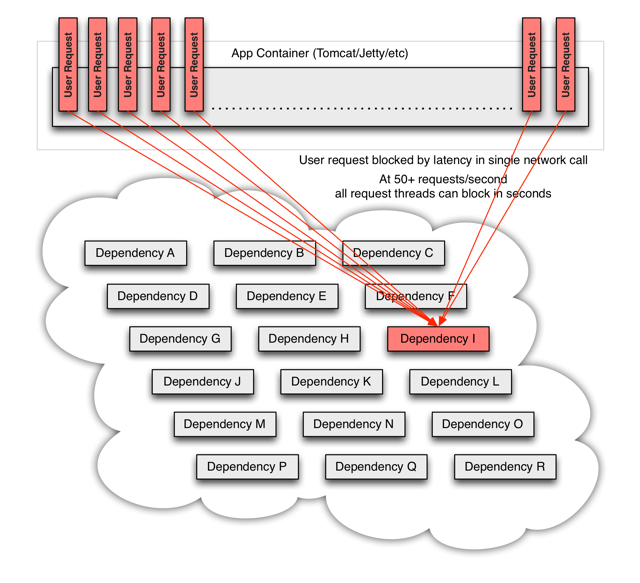

soul hystrix插件是网关用来对流量进行熔断的核心实现，使用的是信号量的方式来处理请求。

## 什么是Hystrix？

在分布式环境中，不可避免地会有许多服务依赖项中的某些失败。Hystrix是一个库，可通过添加延迟公差和容错逻辑来帮助控制这些分布式服务之间的交互。Hystrix通过隔离服务之间的访问点，停止服务之间的级联故障并提供后备选项来实现此目的，所有这些都可以提高系统的整体弹性。

## Hystrix的作用是什么？

* 提供保护并控制延迟和失败，以及通过第三方客户端库（通常是通过网络）访问的依赖项的失败。
* 停止复杂的分布式系统中的级联故障。
* 快速失败并快速恢复。
* 回退并在可能的情况下正常降级。
* 启用近乎实时的监视，警报和操作控制。

## Hystrix解决什么问题？

复杂分布式体系结构中的应用程序具有数十种依赖关系，每种依赖关系不可避免地会在某个时刻失败。如果主机应用程序未与这些外部故障隔离开来，则会收到影响甚至拖垮。

当一切正常时，请求流如下所示：


当许多后端系统之一变得潜在时，它可以阻止整个用户请求：


随着高流量，单个后端依赖关系变得潜在，这可能导致所有服务器上的所有资源在几秒钟内变得饱和。

应用程序中可能会导致网络请求的，通过网络或客户端库延伸的每个点都是潜在故障的根源。比故障更糟糕的是，这些应用程序还会导致服务之间的等待时间增加，从而备份队列，线程和其他系统资源，从而导致整个系统出现更多级联故障。



当通过第三方客户端执行网络访问时，这些问题会更加严重。“第三方”是一个隐藏了实施细节的“黑匣子”，可以随时更改，并且每个客户端库的网络或资源配置都不相同，并且通常难以监视和监控。更改。

更糟糕的是，传递依赖项会执行潜在的昂贵或易出错的网络调用，而不会被应用程序明确调用。

网络连接失败或降级。服务和服务器出现故障或变慢。新的库或服务部署会更改行为或性能特征。客户端库有错误。

所有这些都代表需要隔离和管理的故障和延迟，以使单个故障依赖项无法关闭整个应用程序或系统。

## Hystrix的设计原则是什么？

* 防止任何单个依赖项耗尽所有容器（例如Tomcat）用户线程。
* 减少负载并快速失败，而不是排队。
* 在可行的情况下提供备用，以保护用户免受故障的影响。
* 使用隔离技术（例如隔板，泳道和断路器模式）来限制任何一种依赖关系的影响。
* 通过近实时指标，监视和警报优化发现时间
* 通过在Hystrix的大多数方面中以低延迟传播配置更改来优化恢复时间，并支持动态属性更改，这可以通过低延迟反馈回路进行实时操作修改。
* 防止整个依赖项客户端执行失败，而不仅仅是网络流量失败。

## Hystrix如何实现其目标？

* 将对外部系统（或“依赖项”）的所有调用包装在通常在单独线程中执行的`HystrixCommand`或`HystrixObservableCommand`对象中（这是[命令模式](http://en.wikipedia.org/wiki/Command_pattern)的示例）。
* 超时呼叫花费的时间超过您定义的阈值。有一个默认值，但是对于大多数依赖项，您可以通过“属性”自定义设置这些超时，以使它们略高于针对每个依赖项测得的99.5个百分点的性能。
* 为每个依赖项维护一个小的线程池（或信号灯）；如果已满，发往该依赖项的请求将立即被拒绝，而不是排队。
* 测量成功，失败（客户端抛出的异常），超时和线程拒绝。
* 如果某个服务的错误百分比超过阈值，则使断路器跳闸，以在一段时间内手动或自动停止所有对特定服务的请求。
* 当请求失败，被拒绝，超时或短路时执行回退逻辑。
* 几乎实时监控指标和配置更改。

## 使用Hystrix后的系统


当使用Hystrix封装每个基础依赖项时，每个依赖项都是相互隔离的，受到延迟时发生饱和的资源的限制，并包含回退逻辑，该逻辑决定了在依赖项中发生任何类型的故障时做出什么响应。

## soul 中如何使用Hystrix插件

* 网关中引入依赖

```xml
 <dependency>
      <groupId>org.dromara</groupId>
      <artifactId>soul-spring-boot-starter-plugin-hystrix</artifactId>
       <version>${last.version}</version>
  </dependency>
```

* 开启插件，配置选择器、规则


* 模拟一个超时请求

```java
    @GetMapping("/findByUserId")
    public UserDTO findByUserId(@RequestParam("userId") final String userId) {
        UserDTO userDTO = new UserDTO();
        userDTO.setUserId(userId);
        userDTO.setUserName("hello world");
        try {
            Thread.sleep(10000);
        } catch (InterruptedException e) {
            e.printStackTrace();
        }
        return userDTO;
    }
```

* 请求接口获得响应，发现已经执行了降级处理

