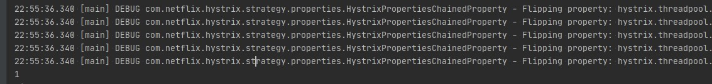

上一篇从宏观上认识了Hystrix，大体了解了Hystrix是什么，能解决什么问题。今天我们再从一个入门例子看起，看看具体怎么使用，过程怎么执行。

* 继承HystrixCommand，进行简单的配置

```java
import com.netflix.hystrix.*;

public class GoodsCommand extends HystrixCommand<Integer> {

    private final GoodsService goodsService;

    protected GoodsCommand(GoodsService goodsService) {
        super(Setter.withGroupKey(HystrixCommandGroupKey.Factory.asKey("GoodsService"))
                .andCommandKey(HystrixCommandKey.Factory.asKey("QueryGoodsById"))
                .andCommandPropertiesDefaults(HystrixCommandProperties.Setter()
                        //至少有10个请求，熔断器才进行错误率的计算
                        .withCircuitBreakerRequestVolumeThreshold(10)
                        //熔断器中断请求5秒后会进入半打开状态,放部分流量过去重试
                        .withCircuitBreakerSleepWindowInMilliseconds(5000)
                        //错误率达到50开启熔断保护
                        .withCircuitBreakerErrorThresholdPercentage(50)
                        .withExecutionTimeoutEnabled(true))
                .andThreadPoolPropertiesDefaults(HystrixThreadPoolProperties
                        .Setter().withCoreSize(10)));
        this.goodsService = goodsService;
    }

    @Override
    protected Integer run() throws Exception {
        return goodsService.queryGoodsById();
    }

    @Override
    protected Integer getFallback() {
        return -1;
    }
}
```

* 实际请求对象的方法

```java
public class GoodsService {

    private final AtomicInteger id = new AtomicInteger();

    public Integer queryGoodsById() {
        return id.incrementAndGet();
    }
}
```

* 调用HystrixCommand的execute方法发起请求

```java
public class GoodsCommandMain {
    public static void main(String[] args) {
        Integer r = new GoodsCommand(new GoodsService()).execute();
        System.out.println(r);
    }
}
```



看到请求正常执行。

* 熔断测试

在queryGoodsById的前10个请求抛出异常进行测试

```java
public class GoodsService {

    private final AtomicInteger id = new AtomicInteger();

    public Integer queryGoodsById() {
        try {
            Thread.sleep(200);
        } catch (InterruptedException e) {
            e.printStackTrace();
        }
        id.incrementAndGet();
        if (id.get() < 10) {
            throw new IllegalStateException();
        }
        return id.get();
    }
}
```

```java
    public static void main(String[] args) {
        GoodsService goodsService = new GoodsService();
        for (int i = 0; i < 20; i++) {
            Integer r = new GoodsCommand(goodsService).execute();
            System.out.println(r);
        }

        try {
            Thread.sleep(6000);
        } catch (InterruptedException e) {
            e.printStackTrace();
        }

        for (int i = 0; i < 20; i++) {
            Integer r = new GoodsCommand(goodsService).execute();
            System.out.println("-->" + r);
        }
    }
```

运行结果

```log
23:25:14.686 [hystrix-GoodsService-9] DEBUG com.netflix.hystrix.AbstractCommand - Error executing HystrixCommand.run(). Proceeding to fallback logic ...
java.lang.IllegalStateException: null
	at io.zjh.hystrix.GoodsService.queryGoodsById(GoodsService.java:20)
	at io.zjh.hystrix.GoodsCommand.run(GoodsCommand.java:27)
	at io.zjh.hystrix.GoodsCommand.run(GoodsCommand.java:5)
	at com.netflix.hystrix.HystrixCommand$2.call(HystrixCommand.java:302)
	at com.netflix.hystrix.HystrixCommand$2.call(HystrixCommand.java:298)
	at rx.internal.operators.OnSubscribeDefer.call(OnSubscribeDefer.java:46)
	at rx.internal.operators.OnSubscribeDefer.call(OnSubscribeDefer.java:35)
	at rx.internal.operators.OnSubscribeLift.call(OnSubscribeLift.java:48)
	at rx.internal.operators.OnSubscribeLift.call(OnSubscribeLift.java:30)
	at rx.internal.operators.OnSubscribeLift.call(OnSubscribeLift.java:48)
	at rx.internal.operators.OnSubscribeLift.call(OnSubscribeLift.java:30)
	at rx.internal.operators.OnSubscribeLift.call(OnSubscribeLift.java:48)
	at rx.internal.operators.OnSubscribeLift.call(OnSubscribeLift.java:30)
	at rx.Observable.unsafeSubscribe(Observable.java:10327)
	at rx.internal.operators.OnSubscribeDefer.call(OnSubscribeDefer.java:51)
	at rx.internal.operators.OnSubscribeDefer.call(OnSubscribeDefer.java:35)
	at rx.Observable.unsafeSubscribe(Observable.java:10327)
	at rx.internal.operators.OnSubscribeDoOnEach.call(OnSubscribeDoOnEach.java:41)
	at rx.internal.operators.OnSubscribeDoOnEach.call(OnSubscribeDoOnEach.java:30)
	at rx.internal.operators.OnSubscribeLift.call(OnSubscribeLift.java:48)
	at rx.internal.operators.OnSubscribeLift.call(OnSubscribeLift.java:30)
	at rx.Observable.unsafeSubscribe(Observable.java:10327)
	at rx.internal.operators.OperatorSubscribeOn$SubscribeOnSubscriber.call(OperatorSubscribeOn.java:100)
	at com.netflix.hystrix.strategy.concurrency.HystrixContexSchedulerAction$1.call(HystrixContexSchedulerAction.java:56)
	at com.netflix.hystrix.strategy.concurrency.HystrixContexSchedulerAction$1.call(HystrixContexSchedulerAction.java:47)
	at com.netflix.hystrix.strategy.concurrency.HystrixContexSchedulerAction.call(HystrixContexSchedulerAction.java:69)
	at rx.internal.schedulers.ScheduledAction.run(ScheduledAction.java:55)
	at java.util.concurrent.Executors$RunnableAdapter.call(Executors.java:511)
	at java.util.concurrent.FutureTask.run$$$capture(FutureTask.java:266)
	at java.util.concurrent.FutureTask.run(FutureTask.java)
	at java.util.concurrent.ThreadPoolExecutor.runWorker(ThreadPoolExecutor.java:1149)
	at java.util.concurrent.ThreadPoolExecutor$Worker.run(ThreadPoolExecutor.java:624)
	at java.lang.Thread.run(Thread.java:748)
-1
10
11
12
-1
-1
-1
-1
-1
-1
-1
-1
-->13
-->14
-->15
-->16
-->17
-->18
-->19
-->20
-->21
```

从结果可以看到，前10次请求都因抛出异常而走到了fallback流程，直接返回了-1，然后过了3个请求，熔断器的统计数据开始发挥了作用，开始进行熔断了，直接快速失败走fallback。然后暂停6s中后继续发起请求，熔断器进入了半开状态，放行一个试探成功后，熔断器关闭，后续的请求就恢复正常了。

## 总结：Hystrix工作流程


1. 构造一个 HystrixCommand或HystrixObservableCommand对象，用于封装请求，并在构造方法配置请求被执行需要的参数；
2. 执行命令；
3. 判断是否使用缓存响应请求，若启用了缓存，且缓存可用，直接使用缓存响应请求。Hystrix支持请求缓存，但需要用户自定义启动；
4. 判断熔断器是否打开，如果打开，跳到第8步；
5. 判断线程池/队列/信号量是否已满，已满则跳到第8步；
6. 执行HystrixObservableCommand.construct()或HystrixCommand.run()，如果执行失败或者超时，跳到第8步；否则，跳到第9步；
7. 统计熔断器监控指标；
8. 走Fallback备用逻辑
9. 返回请求响应