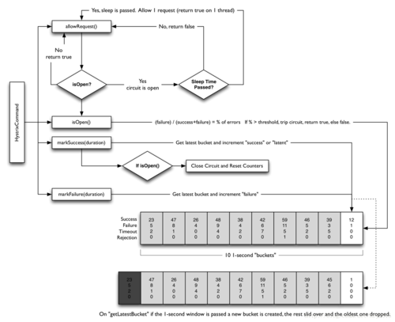

上篇了解了Hystrix的资源隔离的两种方式，线程池和信号量。今天我们再看看Hystrix的熔断。

## 什么是熔断

现实生活中，可能大家都有注意到家庭电路中通常会安装一个保险盒，当负载过载时，保险盒中的保险丝会自动熔断，以保护电路及家里的各种电器，这就是熔断器的一个常见例子。Hystrix中的熔断器(Circuit Breaker)也是起类似作用，Hystrix在运行过程中会向每个commandKey对应的熔断器报告成功、失败、超时和拒绝的状态，熔断器维护并统计这些数据，并根据这些统计信息来决策熔断开关是否打开。如果打开，熔断后续请求，快速返回。隔一段时间（默认是5s）之后熔断器尝试半开，放入一部分流量请求进来，相当于对依赖服务进行一次健康检查，如果请求成功，熔断器关闭。

## 熔断器配置

Circuit Breaker主要包括如下6个参数：

* circuitBreaker.enabled

是否启用熔断器，默认是TRUE。

* circuitBreaker.forceOpen

熔断器强制打开，始终保持打开状态，不关注熔断开关的实际状态。默认值FLASE。

* circuitBreaker.forceClosed

熔断器强制关闭，始终保持关闭状态，不关注熔断开关的实际状态。默认值FLASE。

* circuitBreaker.errorThresholdPercentage

错误率，默认值50%，例如一段时间（10s）内有100个请求，其中有54个超时或者异常，那么这段时间内的错误率是54%，大于了默认值50%，这种情况下会触发熔断器打开。

* circuitBreaker.requestVolumeThreshold

默认值20。含义是一段时间内至少有20个请求才进行errorThresholdPercentage计算。比如一段时间了有19个请求，且这些请求全部失败了，错误率是100%，但熔断器不会打开，总请求数不满足20。

* circuitBreaker.sleepWindowInMilliseconds

半开状态试探睡眠时间，默认值5000ms。如：当熔断器开启5000ms之后，会尝试放过去一部分流量进行试探，确定依赖服务是否恢复。

## 熔断器工作原理

**第一步**，调用allowRequest()判断是否允许将请求提交到线程池

1. 如果熔断器强制打开，circuitBreaker.forceOpen为true，不允许放行，返回。
2. 如果熔断器强制关闭，circuitBreaker.forceClosed为true，允许放行。此外不必关注熔断器实际状态，也就是说熔断器仍然会维护统计数据和开关状态，只是不生效而已。

**第二步**，调用isOpen()判断熔断器开关是否打开

1. 如果熔断器开关打开，进入第三步，否则继续；
2. 如果一个周期内总的请求数小于circuitBreaker.requestVolumeThreshold的值，允许请求放行，否则继续；
3. 如果一个周期内错误率小于circuitBreaker.errorThresholdPercentage的值，允许请求放行。否则，打开熔断器开关，进入第三步。

**第三步**，调用allowSingleTest()判断是否允许单个请求通行，检查依赖服务是否恢复

1. 如果熔断器打开，且距离熔断器打开的时间或上一次试探请求放行的时间超过circuitBreaker.sleepWindowInMilliseconds的值时，熔断器器进入半开状态，允许放行一个试探请求；否则，不允许放行。

此外，为了提供决策依据，每个熔断器默认维护了10个bucket，每秒一个bucket，当新的bucket被创建时，最旧的bucket会被抛弃。其中每个blucket维护了请求成功、失败、超时、拒绝的计数器，Hystrix负责收集并统计这些计数器。