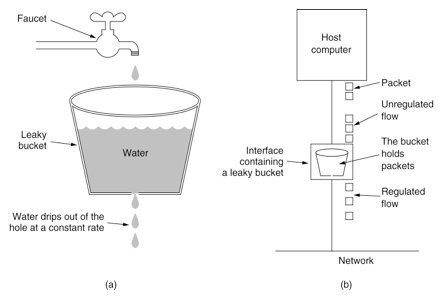
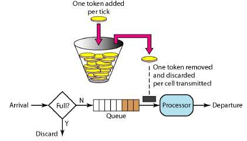
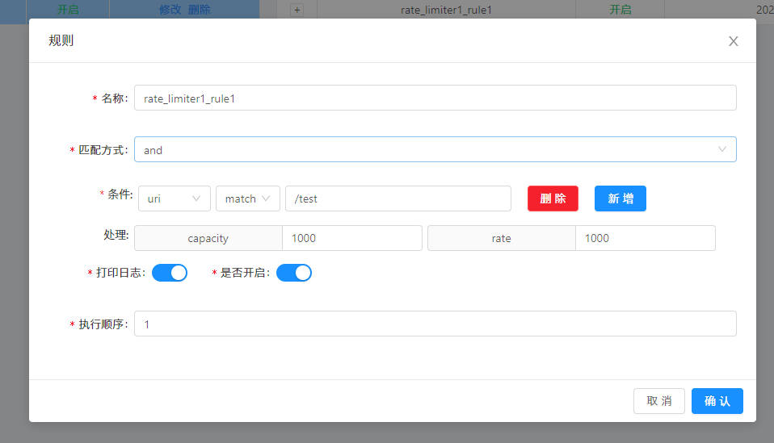
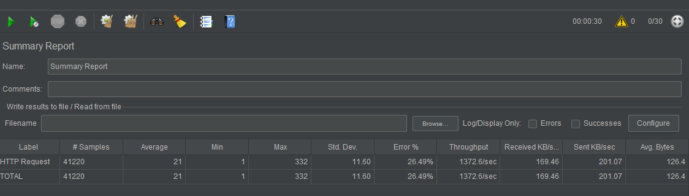

## RateLimiter插件

限流插件，是网关对流量管控限制核心的实现。可以到接口级别，也可以到参数级别。

## 技术方案

采用redis令牌桶算法进行限流。


## 什么是令牌桶算法?

令牌桶算法是一种限流算法，他与漏桶算法的实现是一种相反的实现。

漏桶算法是按照一定频率的速率进行漏水，然后对于我们的请求就可以想象成上边的水龙头。



令牌桶算法则是定时的往桶中放入令牌，然后每次请求都会从令牌桶中获取一个令牌，如果桶中没有令牌，则拒绝请求或者阻塞直到令牌可以获得。



## 牛刀小试

* soul-examples-http中引入RateLimiter插件

```xml
        <dependency>
            <groupId>org.dromara</groupId>
            <artifactId>soul-spring-boot-starter-plugin-ratelimiter</artifactId>
            <version>${soul.version}</version>
        </dependency>
```

* admin中开启RateLimiter插件


* 配置限流选择器和规则，两个重要的蚕食capacity、rate。

**rate：是你允许用户每秒执行多少请求，而丢弃任何请求。这是令牌桶的填充速率。**

**capacity：是允许用户在一秒钟内执行的最大请求数。这是令牌桶可以保存的令牌数。**


用jmeter压测一番，看看配置是否好用


从图中可看到99.03%的错误率，且错误请求响应参数为

```json
{"code":429,"message":"You have been restricted, please try again later!","data":null}
```

看来配置确实生效了。那么容量调大点再压





这下错误率直接降为26.49%了。就这么简单，一个限流的功能就整起来了，非常方便灵活，并且随时可以调整配置，这就是soul网关强大之处呀。