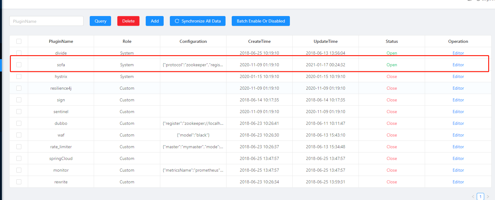
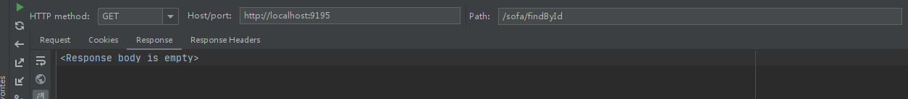
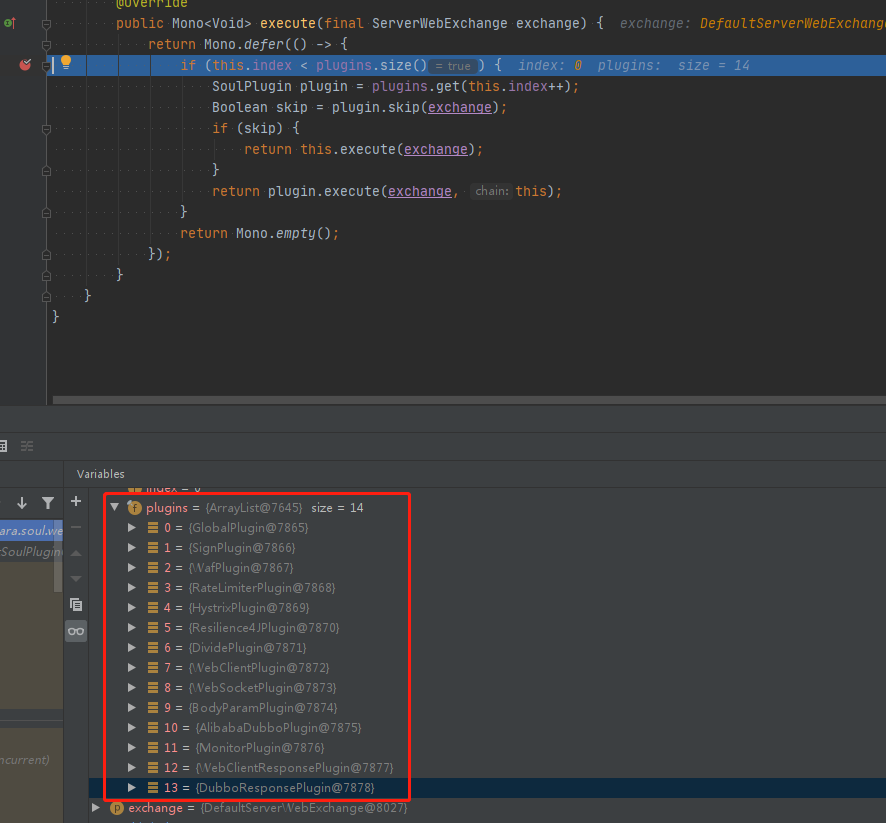

#### 什么是sofa-rpc？

sofa-rpc 最早源于阿里内部的 HSF，是近期蚂蚁金服开源的一个高可扩展性、高性能、生产级的 Java RPC 框架。sofa-rpc 在蚂蚁金服已经历了十多年的发展，致力于简化应用之间的 RPC 调用。为应用提供方便透明、稳定高效的点对点远程服务调用方案。为了用户和开发者方便的进行功能扩展，SOFA-RPC 提供了丰富的模型抽象和可扩展接口，包括过滤器、路由、负载均衡等。同时围绕 SOFA-RPC 框架及其周边组件提供丰富的微服务治理方案。

#### sofa-rpc功能特性

* 透明化、高性能的远程服务调用
* 支持多种服务路由及负载均衡策略
* 支持多种注册中心的集成
* 支持 bolt、rest、dubbo 等多种通信协议
* 支持同步、单向、回调、泛化等多种调用方式
* 支持集群容错、服务预热、自动故障隔离
* 强大的扩展功能，可以按需扩展各个功能组件

#### sofa服务接入soul网关

* 引入soul对sofa的支持依赖

```xml
        <dependency>
            <groupId>org.dromara</groupId>
            <artifactId>soul-spring-boot-starter-client-sofa</artifactId>
            <version>${soul.version}</version>
        </dependency>
```

* 增加发布网关的配置

```xml
soul:
  sofa:
    adminUrl: http://localhost:9095
    contextPath: /sofa
    appName: sofa
```

* 给需要发布到网关的接口增加注解@SoulSofaClient

```java
    @Override
    @SoulSofaClient(path = "/findById", desc = "Find by Id")
    public DubboTest findById(final String id) {
        DubboTest dubboTest = new DubboTest();
        dubboTest.setId(id);
        dubboTest.setName("hello world Soul Sofa, findById");
        return dubboTest;
    }

    @Override
    @SoulSofaClient(path = "/findAll", desc = "Get all data")
    public DubboTest findAll() {
        DubboTest dubboTest = new DubboTest();
        dubboTest.setName("hello world Soul Sofa , findAll");
        dubboTest.setId(String.valueOf(new Random().nextInt()));
        return dubboTest;
    }

    @Override
    @SoulSofaClient(path = "/insert", desc = "Insert a row of data")
    public DubboTest insert(final DubboTest dubboTest) {
        dubboTest.setName("hello world Soul Sofa: " + dubboTest.getName());
        return dubboTest;
    }
```

* 启动sofa应用发布到soul中
* 网关中开启sofa插件



* 通过网关调用sofa服务



坑！发现调不通，神奇，debug查看，sofa插件并未加载，所以响应了空

