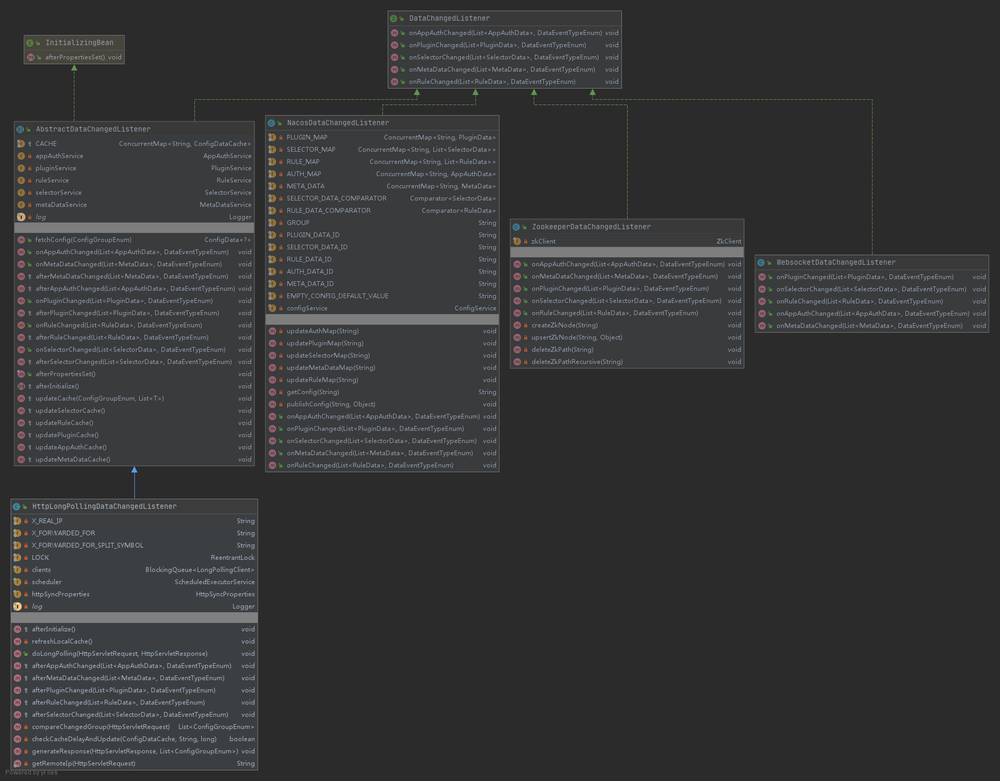
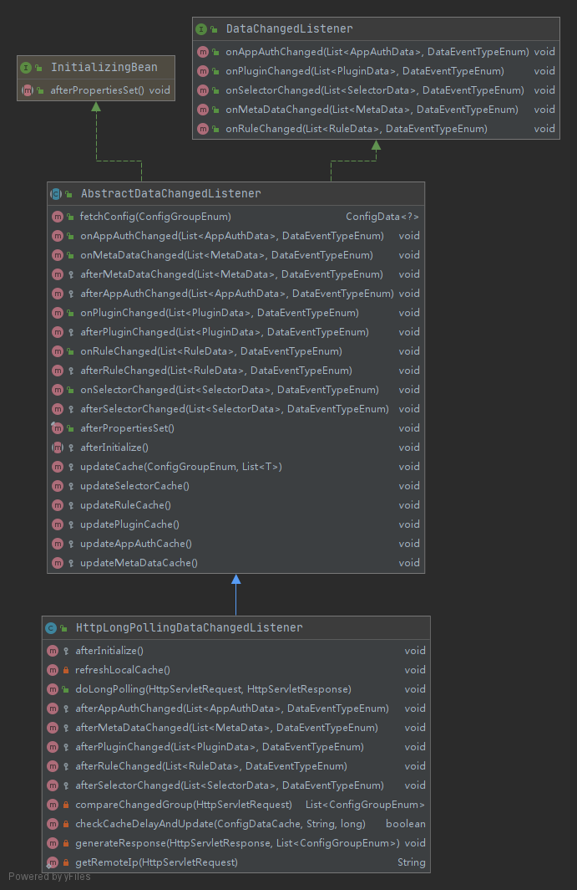
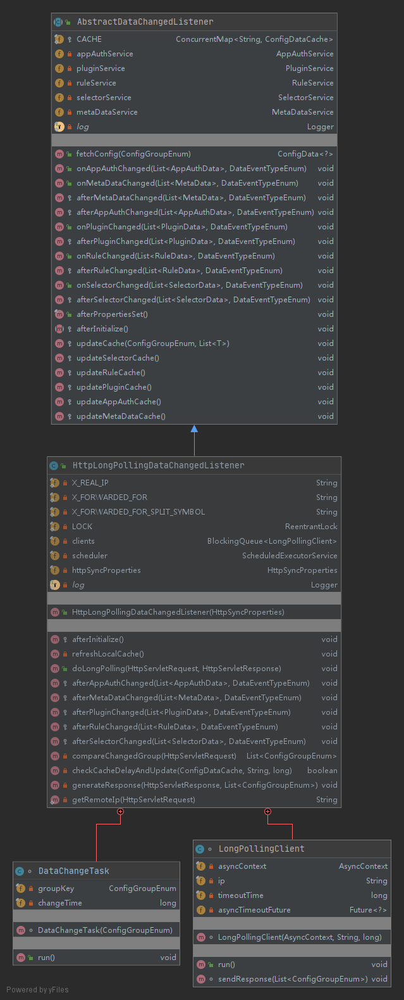

## soul数据同步

数据同步是指将 soul-admin 配置的数据，同步到 soul集群中的JVM内存里面，是网关高性能的关键。

## soul支持同步方式

1. websocket同步（默认方式，推荐）
2. zookeeper同步
3. http长轮询同步
4. nacos同步

#### 同步数据的类图



DataChangedListener作为数据变化的顶级接口声明了授权、插件、选择器、元数据、规则数据变化的默认方法。DataChangedListener总共有4个子类，分别是AbstractDataChangedListener、NacosDataChangedListener、ZookeeperDataChangedListener、WebsocketDataChangedListener，分别对应着4种同步方式。

## http长轮询同步核心类详解



AbstractDataChangedListener实现了DataChangedListener、InitializingBean接口。相对较简单，主要作用是维护admin配置数据缓存ConcurrentMap<String, ConfigDataCache> CACHE。而http长轮询的实现关键在其子类HttpLongPollingDataChangedListener。



HttpLongPollingDataChangedListener详细说明如下

```java
public class HttpLongPollingDataChangedListener extends AbstractDataChangedListener {

    ......省略
    private static final ReentrantLock LOCK = new ReentrantLock();
    // 维护长轮询连接阻塞队列
    private final BlockingQueue<LongPollingClient> clients;
    // 调度线程池
    private final ScheduledExecutorService scheduler;
    // 刷新缓存配置
    private final HttpSyncProperties httpSyncProperties;

    // bean初始化后启动定时任务，默认5分钟刷新一次缓存
    @Override
    protected void afterInitialize() {
        long syncInterval = httpSyncProperties.getRefreshInterval().toMillis();
        // Periodically check the data for changes and update the cache
        scheduler.scheduleWithFixedDelay(() -> {
            log.info("http sync strategy refresh config start.");
            try {
                this.refreshLocalCache();
                log.info("http sync strategy refresh config success.");
            } catch (Exception e) {
                log.error("http sync strategy refresh config error!", e);
            }
        }, syncInterval, syncInterval, TimeUnit.MILLISECONDS);
        log.info("http sync strategy refresh interval: {}ms", syncInterval);
    }

    private void refreshLocalCache() {
        this.updateAppAuthCache();
        this.updatePluginCache();
        this.updateRuleCache();
        this.updateSelectorCache();
        this.updateMetaDataCache();
    }

    // 比较数是否有变化，如果有变化立即响应，如果没有变化则使用Servlet3.0异步响应技术，先把请求放入阻塞队列，
    // 设定60秒后调度。60秒后不管有没有数据变化都进行响应，并移除这个请求。
    public void doLongPolling(final HttpServletRequest request, final HttpServletResponse response) {

        // compare group md5
        List<ConfigGroupEnum> changedGroup = compareChangedGroup(request);
        String clientIp = getRemoteIp(request);

        // response immediately.
        if (CollectionUtils.isNotEmpty(changedGroup)) {
            this.generateResponse(response, changedGroup);
            log.info("send response with the changed group, ip={}, group={}", clientIp, changedGroup);
            return;
        }

        // listen for configuration changed.
        final AsyncContext asyncContext = request.startAsync();

        // AsyncContext.settimeout() does not timeout properly, so you have to control it yourself
        asyncContext.setTimeout(0L);

        // block client's thread.
        scheduler.execute(new LongPollingClient(asyncContext, clientIp, HttpConstants.SERVER_MAX_HOLD_TIMEOUT));
    }

    // 如果授权数据有变化，则响应通知变化并移除所有的长链接请求。
    @Override
    protected void afterAppAuthChanged(final List<AppAuthData> changed, final DataEventTypeEnum eventType) {
        scheduler.execute(new DataChangeTask(ConfigGroupEnum.APP_AUTH));
    }

    // 如果元数据有变化，则响应通知变化并移除所有的长链接请求。
    @Override
    protected void afterMetaDataChanged(final List<MetaData> changed, final DataEventTypeEnum eventType) {
        scheduler.execute(new DataChangeTask(ConfigGroupEnum.META_DATA));
    }
   
    // 如果插件数据有变化，则响应通知变化并移除所有的长链接请求。
    @Override
    protected void afterPluginChanged(final List<PluginData> changed, final DataEventTypeEnum eventType) {
        scheduler.execute(new DataChangeTask(ConfigGroupEnum.PLUGIN));
    }

    // 如果规则数据有变化，则响应通知变化并移除所有的长链接请求。
    @Override
    protected void afterRuleChanged(final List<RuleData> changed, final DataEventTypeEnum eventType) {
        scheduler.execute(new DataChangeTask(ConfigGroupEnum.RULE));
    }

    // 如果选择器数据有变化，则响应通知变化并移除所有的长链接请求。
    @Override
    protected void afterSelectorChanged(final List<SelectorData> changed, final DataEventTypeEnum eventType) {
        scheduler.execute(new DataChangeTask(ConfigGroupEnum.SELECTOR));
    }

    // 取出网关数据修改时间戳和md5值比较数据是否有变化
    private List<ConfigGroupEnum> compareChangedGroup(final HttpServletRequest request) {
        List<ConfigGroupEnum> changedGroup = new ArrayList<>(4);
        for (ConfigGroupEnum group : ConfigGroupEnum.values()) {
            // md5,lastModifyTime
            String[] params = StringUtils.split(request.getParameter(group.name()), ',');
            if (params == null || params.length != 2) {
                throw new SoulException("group param invalid:" + request.getParameter(group.name()));
            }
            String clientMd5 = params[0];
            long clientModifyTime = NumberUtils.toLong(params[1]);
            ConfigDataCache serverCache = CACHE.get(group.name());
            // do check.
            if (this.checkCacheDelayAndUpdate(serverCache, clientMd5, clientModifyTime)) {
                changedGroup.add(group);
            }
        }
        return changedGroup;
    }

    // 对比时间戳和md5值，如果有变化则返回true，无变化则返回false。
    private boolean checkCacheDelayAndUpdate(final ConfigDataCache serverCache, final String clientMd5, final long clientModifyTime) {

        // is the same, doesn't need to be updated
        if (StringUtils.equals(clientMd5, serverCache.getMd5())) {
            return false;
        }

        // if the md5 value is different, it is necessary to compare lastModifyTime.
        long lastModifyTime = serverCache.getLastModifyTime();
        if (lastModifyTime >= clientModifyTime) {
            // the client's config is out of date.
            return true;
        }

        // the lastModifyTime before client, then the local cache needs to be updated.
        // Considering the concurrency problem, admin must lock,
        // otherwise it may cause the request from soul-web to update the cache concurrently, causing excessive db pressure
        boolean locked = false;
        try {
            locked = LOCK.tryLock(5, TimeUnit.SECONDS);
        } catch (InterruptedException e) {
            Thread.currentThread().interrupt();
            return true;
        }
        if (locked) {
            try {
                ConfigDataCache latest = CACHE.get(serverCache.getGroup());
                if (latest != serverCache) {
                    // the cache of admin was updated. if the md5 value is the same, there's no need to update.
                    return !StringUtils.equals(clientMd5, latest.getMd5());
                }
                // load cache from db.
                this.refreshLocalCache();
                latest = CACHE.get(serverCache.getGroup());
                return !StringUtils.equals(clientMd5, latest.getMd5());
            } finally {
                LOCK.unlock();
            }
        }

        // not locked, the client need to be updated.
        return true;

    }

    /**
     * Send response datagram.
     *
     * @param response      the response
     * @param changedGroups the changed groups
     */
    private void generateResponse(final HttpServletResponse response, final List<ConfigGroupEnum> changedGroups) {
        try {
            response.setHeader("Pragma", "no-cache");
            response.setDateHeader("Expires", 0);
            response.setHeader("Cache-Control", "no-cache,no-store");
            response.setContentType(MediaType.APPLICATION_JSON_VALUE);
            response.setStatus(HttpServletResponse.SC_OK);
            response.getWriter().println(GsonUtils.getInstance().toJson(SoulAdminResult.success(SoulResultMessage.SUCCESS, changedGroups)));
        } catch (IOException ex) {
            log.error("Sending response failed.", ex);
        }
    }

    // 数据变化任务，当数据有变化就会提交该任务到线程池，并发响应和移除长轮询链接
    class DataChangeTask implements Runnable {

        /**
         * The Group where the data has changed.
         */
        private final ConfigGroupEnum groupKey;

        /**
         * The Change time.
         */
        private final long changeTime = System.currentTimeMillis();

        /**
         * Instantiates a new Data change task.
         *
         * @param groupKey the group key
         */
        DataChangeTask(final ConfigGroupEnum groupKey) {
            this.groupKey = groupKey;
        }

        @Override
        public void run() {
            for (Iterator<LongPollingClient> iter = clients.iterator(); iter.hasNext();) {
                LongPollingClient client = iter.next();
                iter.remove();
                client.sendResponse(Collections.singletonList(groupKey));
                log.info("send response with the changed group,ip={}, group={}, changeTime={}", client.ip, groupKey, changeTime);
            }
        }
    }

    // 长链接保持类。长链接60秒后调度，响应并移除。
    class LongPollingClient implements Runnable {

        /**
         * The Async context.
         */
        private final AsyncContext asyncContext;

        /**
         * The Ip.
         */
        private final String ip;

        /**
         * The Timeout time.
         */
        private final long timeoutTime;

        /**
         * The Async timeout future.
         */
        private Future<?> asyncTimeoutFuture;

        /**
         * Instantiates a new Long polling client.
         *
         * @param ac          the ac
         * @param ip          the ip
         * @param timeoutTime the timeout time
         */
        LongPollingClient(final AsyncContext ac, final String ip, final long timeoutTime) {
            this.asyncContext = ac;
            this.ip = ip;
            this.timeoutTime = timeoutTime;
        }

        @Override
        public void run() {
            this.asyncTimeoutFuture = scheduler.schedule(() -> {
                clients.remove(LongPollingClient.this);
                List<ConfigGroupEnum> changedGroups = compareChangedGroup((HttpServletRequest) asyncContext.getRequest());
                sendResponse(changedGroups);
            }, timeoutTime, TimeUnit.MILLISECONDS);
            clients.add(this);
        }

        /**
         * Send response.
         *
         * @param changedGroups the changed groups
         */
        void sendResponse(final List<ConfigGroupEnum> changedGroups) {
            // cancel scheduler
            if (null != asyncTimeoutFuture) {
                asyncTimeoutFuture.cancel(false);
            }
            generateResponse((HttpServletResponse) asyncContext.getResponse(), changedGroups);
            asyncContext.complete();
        }
    }

}
```

## 疑问：为何缓存数据为变化还要去数据库中刷新一次数据？

```java
        // the lastModifyTime before client, then the local cache needs to be updated.
        // Considering the concurrency problem, admin must lock,
        // otherwise it may cause the request from soul-web to update the cache concurrently, causing excessive db pressure
        boolean locked = false;
        try {
            locked = LOCK.tryLock(5, TimeUnit.SECONDS);
        } catch (InterruptedException e) {
            Thread.currentThread().interrupt();
            return true;
        }
        if (locked) {
            try {
                ConfigDataCache latest = CACHE.get(serverCache.getGroup());
                if (latest != serverCache) {
                    // the cache of admin was updated. if the md5 value is the same, there's no need to update.
                    return !StringUtils.equals(clientMd5, latest.getMd5());
                }
                // load cache from db.
                this.refreshLocalCache();
                latest = CACHE.get(serverCache.getGroup());
                return !StringUtils.equals(clientMd5, latest.getMd5());
            } finally {
                LOCK.unlock();
            }
        }
```