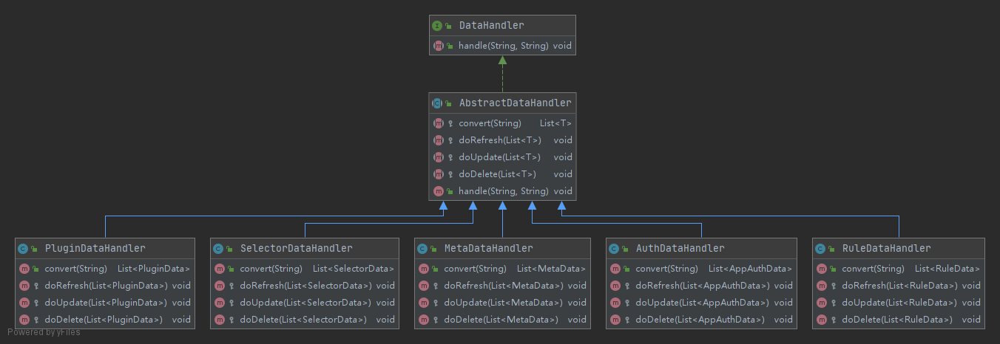

## soul网关推荐采用websocket方式同步数据，对比http长轮询方式有何优势？

1. websocket方式能实时通知，而http长轮询方式只能做到准实时。
2. websocket同步采用增量处理，而http长轮询方式是全量数据，当数据量大的时候http长轮询方式就会有性能问题。

## websocket同步方式详解

网关启动的时候注册WebSocketClient实例子类SoulWebsocketClient，此类负责与admin的websocket连接。数据同步业务全权委托给WebSocketDataHandler进行处理，符合单一职责原则，保持了此类的简单性。

```java
public final class SoulWebsocketClient extends WebSocketClient {
  
    private volatile boolean alreadySync = Boolean.FALSE;
 
    private final WebsocketDataHandler websocketDataHandler;
 
    public SoulWebsocketClient(final URI serverUri, final PluginDataSubscriber pluginDataSubscriber,
                               final List<MetaDataSubscriber> metaDataSubscribers, final List<AuthDataSubscriber> authDataSubscribers) {
        super(serverUri);
        this.websocketDataHandler = new WebsocketDataHandler(pluginDataSubscriber, metaDataSubscribers, authDataSubscribers);
    }
  
    @Override
    public void onOpen(final ServerHandshake serverHandshake) {
        if (!alreadySync) {
            send(DataEventTypeEnum.MYSELF.name());
            alreadySync = true;
        }
    }
  
    @Override
    public void onMessage(final String result) {
        handleResult(result);
    }
  
    @SuppressWarnings("ALL")
    private void handleResult(final String result) {
        WebsocketData websocketData = GsonUtils.getInstance().fromJson(result, WebsocketData.class);
        ConfigGroupEnum groupEnum = ConfigGroupEnum.acquireByName(websocketData.getGroupType());
        String eventType = websocketData.getEventType();
        String json = GsonUtils.getInstance().toJson(websocketData.getData());
        websocketDataHandler.executor(groupEnum, json, eventType);
    }
}
```

WebsocketDataHandler采用工厂模式，把PluginDataHandler、SelectorDataHandler、RuleDataHandler、AuthDataHandler、MetaDataHandler创建好，通过同步数据的类型自动匹配处理的逻辑，避免了令人生厌的if-else判断逻辑。

```java
public class WebsocketDataHandler {

    private static final EnumMap<ConfigGroupEnum, DataHandler> ENUM_MAP = new EnumMap<>(ConfigGroupEnum.class);

    /**
     * Instantiates a new Websocket data handler.
     *
     * @param pluginDataSubscriber the plugin data subscriber
     * @param metaDataSubscribers  the meta data subscribers
     * @param authDataSubscribers  the auth data subscribers
     */
    public WebsocketDataHandler(final PluginDataSubscriber pluginDataSubscriber,
                                final List<MetaDataSubscriber> metaDataSubscribers,
                                final List<AuthDataSubscriber> authDataSubscribers) {
        ENUM_MAP.put(ConfigGroupEnum.PLUGIN, new PluginDataHandler(pluginDataSubscriber));
        ENUM_MAP.put(ConfigGroupEnum.SELECTOR, new SelectorDataHandler(pluginDataSubscriber));
        ENUM_MAP.put(ConfigGroupEnum.RULE, new RuleDataHandler(pluginDataSubscriber));
        ENUM_MAP.put(ConfigGroupEnum.APP_AUTH, new AuthDataHandler(authDataSubscribers));
        ENUM_MAP.put(ConfigGroupEnum.META_DATA, new MetaDataHandler(metaDataSubscribers));
    }

    /**
     * Executor.
     *
     * @param type      the type
     * @param json      the json
     * @param eventType the event type
     */
    public void executor(final ConfigGroupEnum type, final String json, final String eventType) {
        ENUM_MAP.get(type).handle(json, eventType);
    }
}
```

DataHandler负责数据的具体处理。而DataHandler只是一个接口，声明了一个handle方法。其余不同处理逻辑全由子类子具体负责。



AbstractDataHandler继承DataHandler，实现了通用的handle方法。并声明了convert、doRefresh、doUpdate、doDelete四个模板方法。这里就是经典设计模式中的模板模式了。而具体的Handler做的事情也非常简单，只是把数据变更通知订阅者而已。此处又使用了经典设计模式中的观察者模式。PluginDataHandler和其它handler一样。

```java
@RequiredArgsConstructor
public class PluginDataHandler extends AbstractDataHandler<PluginData> {

    private final PluginDataSubscriber pluginDataSubscriber;

    @Override
    public List<PluginData> convert(final String json) {
        return GsonUtils.getInstance().fromList(json, PluginData.class);
    }

    @Override
    protected void doRefresh(final List<PluginData> dataList) {
        pluginDataSubscriber.refreshPluginDataSelf(dataList);
        dataList.forEach(pluginDataSubscriber::onSubscribe);
    }

    @Override
    protected void doUpdate(final List<PluginData> dataList) {
        dataList.forEach(pluginDataSubscriber::onSubscribe);
    }

    @Override
    protected void doDelete(final List<PluginData> dataList) {
        dataList.forEach(pluginDataSubscriber::unSubscribe);
    }

}
```

订阅者收到数据变更通知后刷新本地缓存。以MetaDataAllSubscriber为例，做的事情很简单。就是缓存和删除缓存。

```java
public class MetaDataAllSubscriber implements MetaDataSubscriber {
  
    @Override
    public void onSubscribe(final MetaData metaData) {
        MetaDataCache.getInstance().cache(metaData);
    }
  
    @Override
    public void unSubscribe(final MetaData metaData) {
        MetaDataCache.getInstance().remove(metaData);
    }
}
```

而上述操作的上帝之手就是WebsocketSyncDataService。它根据配置的url数量创建WebSocketClient去连接admin。并开启定时任务检测连接是否断开，如果断开则重连。默认30秒检测一次。

```java
public class WebsocketSyncDataService implements SyncDataService, AutoCloseable {

    private final List<WebSocketClient> clients = new ArrayList<>();

    private final ScheduledThreadPoolExecutor executor;
  
    /**
     * Instantiates a new Websocket sync cache.
     *
     * @param websocketConfig      the websocket config
     * @param pluginDataSubscriber the plugin data subscriber
     * @param metaDataSubscribers  the meta data subscribers
     * @param authDataSubscribers  the auth data subscribers
     */
    public WebsocketSyncDataService(final WebsocketConfig websocketConfig,
                                    final PluginDataSubscriber pluginDataSubscriber,
                                    final List<MetaDataSubscriber> metaDataSubscribers,
                                    final List<AuthDataSubscriber> authDataSubscribers) {
        String[] urls = StringUtils.split(websocketConfig.getUrls(), ",");
        executor = new ScheduledThreadPoolExecutor(urls.length, SoulThreadFactory.create("websocket-connect", true));
        for (String url : urls) {
            try {
                clients.add(new SoulWebsocketClient(new URI(url), Objects.requireNonNull(pluginDataSubscriber), metaDataSubscribers, authDataSubscribers));
            } catch (URISyntaxException e) {
                log.error("websocket url({}) is error", url, e);
            }
        }
        try {
            for (WebSocketClient client : clients) {
                boolean success = client.connectBlocking(3000, TimeUnit.MILLISECONDS);
                if (success) {
                    log.info("websocket connection is successful.....");
                } else {
                    log.error("websocket connection is error.....");
                }
                executor.scheduleAtFixedRate(() -> {
                    try {
                        if (client.isClosed()) {
                            boolean reconnectSuccess = client.reconnectBlocking();
                            if (reconnectSuccess) {
                                log.info("websocket reconnect is successful.....");
                            } else {
                                log.error("websocket reconnection is error.....");
                            }
                        }
                    } catch (InterruptedException e) {
                        log.error("websocket connect is error :{}", e.getMessage());
                    }
                }, 10, 30, TimeUnit.SECONDS);
            }
            /* client.setProxy(new Proxy(Proxy.Type.HTTP, new InetSocketAddress("proxyaddress", 80)));*/
        } catch (InterruptedException e) {
            log.info("websocket connection...exception....", e);
        }

    }
  
    @Override
    public void close() {
        for (WebSocketClient client : clients) {
            if (!client.isClosed()) {
                client.close();
            }
        }
        if (Objects.nonNull(executor)) {
            executor.shutdown();
        }
    }
}
```

admin这边由WebsocketCollector来维持websocket的连接。当网关刚启动的时候会发送一个MYSELF的消息，admin收到后变发送全量数据进行第一次同步。而后的消息变化就会是增量的同步。从而在数据量大的情况也也依然保证同步的高性能。

```java
public class WebsocketCollector {

    private static final Set<Session> SESSION_SET = new CopyOnWriteArraySet<>();

    private static Session session;

    /**
     * On message.
     *
     * @param message the message
     * @param session the session
     */
    @OnMessage
    public void onMessage(final String message, final Session session) {
        if (message.equals(DataEventTypeEnum.MYSELF.name())) {
            WebsocketCollector.session = session;
            SpringBeanUtils.getInstance().getBean(SyncDataService.class).syncAll(DataEventTypeEnum.MYSELF);
        }
    }

    /**
     * Send.
     *
     * @param message the message
     * @param type    the type
     */
    public static void send(final String message, final DataEventTypeEnum type) {
        if (StringUtils.isNotBlank(message)) {
            if (DataEventTypeEnum.MYSELF == type) {
                try {
                    session.getBasicRemote().sendText(message);
                } catch (IOException e) {
                    log.error("websocket send result is exception: ", e);
                }
                return;
            }
            for (Session session : SESSION_SET) {
                try {
                    session.getBasicRemote().sendText(message);
                } catch (IOException e) {
                    log.error("websocket send result is exception: ", e);
                }
            }
        }
    }
}

```

admin通过spring事件通知机制，一旦有数据修改则触发事件。WebsocketDataChangedListener接收到数据变更通知后就给网关发送消息。

```java
public class WebsocketDataChangedListener implements DataChangedListener {

    @Override
    public void onPluginChanged(final List<PluginData> pluginDataList, final DataEventTypeEnum eventType) {
        WebsocketData<PluginData> websocketData =
                new WebsocketData<>(ConfigGroupEnum.PLUGIN.name(), eventType.name(), pluginDataList);
        WebsocketCollector.send(GsonUtils.getInstance().toJson(websocketData), eventType);
    }

    @Override
    public void onSelectorChanged(final List<SelectorData> selectorDataList, final DataEventTypeEnum eventType) {
        WebsocketData<SelectorData> websocketData =
                new WebsocketData<>(ConfigGroupEnum.SELECTOR.name(), eventType.name(), selectorDataList);
        WebsocketCollector.send(GsonUtils.getInstance().toJson(websocketData), eventType);
    }

    @Override
    public void onRuleChanged(final List<RuleData> ruleDataList, final DataEventTypeEnum eventType) {
        WebsocketData<RuleData> configData =
                new WebsocketData<>(ConfigGroupEnum.RULE.name(), eventType.name(), ruleDataList);
        WebsocketCollector.send(GsonUtils.getInstance().toJson(configData), eventType);
    }

    @Override
    public void onAppAuthChanged(final List<AppAuthData> appAuthDataList, final DataEventTypeEnum eventType) {
        WebsocketData<AppAuthData> configData =
                new WebsocketData<>(ConfigGroupEnum.APP_AUTH.name(), eventType.name(), appAuthDataList);
        WebsocketCollector.send(GsonUtils.getInstance().toJson(configData), eventType);
    }

    @Override
    public void onMetaDataChanged(final List<MetaData> metaDataList, final DataEventTypeEnum eventType) {
        WebsocketData<MetaData> configData =
                new WebsocketData<>(ConfigGroupEnum.META_DATA.name(), eventType.name(), metaDataList);
        WebsocketCollector.send(GsonUtils.getInstance().toJson(configData), eventType);
    }

}

```

就这样，soul网关就完成了websocket方式的数据同步。