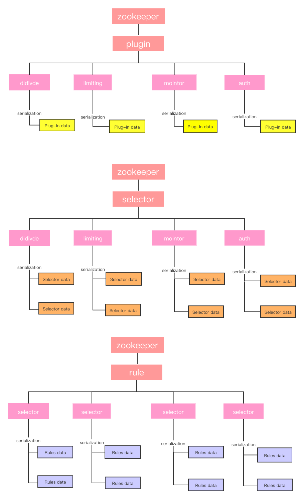

## soul网关采用zookeeper方式同步数据，对比http长轮询方式有何优势？

1. websocket方式能实时通知，而http长轮询方式只能做到准实时。
2. websocket同步采用增量处理，而http长轮询方式是全量数据，当数据量大的时候http长轮询方式就会有性能问题。

## zookeeper方式同步数据原理

基于 zookeeper 的同步原理很简单，主要是依赖 `zookeeper` 的 watch 机制，`soul-web` 会监听配置的节点，`soul-admin` 在启动的时候，会将数据全量写入 `zookeeper`，后续数据发生变更时，会增量更新 `zookeeper` 的节点，与此同时，`soul-web` 会监听配置信息的节点，一旦有信息变更时，会更新本地缓存。

.png)
.png)


## zookeeper同步方式详解

网关中负责同步的类是ZookeeperSyncDataService。其作用就是网关启动的时候读取admin写入zookeeper中的节点数据，并进行监听。非常之简单易懂。

```java
public class ZookeeperSyncDataService implements SyncDataService, AutoCloseable {

    private final ZkClient zkClient;

    private final PluginDataSubscriber pluginDataSubscriber;

    private final List<MetaDataSubscriber> metaDataSubscribers;

    private final List<AuthDataSubscriber> authDataSubscribers;
   
    // 启动则读取全量数据并进行监听
    /**
     * Instantiates a new Zookeeper cache manager.
     *
     * @param zkClient             the zk client
     * @param pluginDataSubscriber the plugin data subscriber
     * @param metaDataSubscribers  the meta data subscribers
     * @param authDataSubscribers  the auth data subscribers
     */
    public ZookeeperSyncDataService(final ZkClient zkClient, final PluginDataSubscriber pluginDataSubscriber,
                                    final List<MetaDataSubscriber> metaDataSubscribers, final List<AuthDataSubscriber> authDataSubscribers) {
        this.zkClient = zkClient;
        this.pluginDataSubscriber = pluginDataSubscriber;
        this.metaDataSubscribers = metaDataSubscribers;
        this.authDataSubscribers = authDataSubscribers;
        watcherData();
        watchAppAuth();
        watchMetaData();
    }

    private void watcherData() {
        final String pluginParent = ZkPathConstants.PLUGIN_PARENT;
        List<String> pluginZKs = zkClientGetChildren(pluginParent);
        for (String pluginName : pluginZKs) {
            watcherAll(pluginName);
        }
        zkClient.subscribeChildChanges(pluginParent, (parentPath, currentChildren) -> {
            if (CollectionUtils.isNotEmpty(currentChildren)) {
                for (String pluginName : currentChildren) {
                    watcherAll(pluginName);
                }
            }
        });
    }

    private void watcherAll(final String pluginName) {
        watcherPlugin(pluginName);
        watcherSelector(pluginName);
        watcherRule(pluginName);
    }

    private void watcherPlugin(final String pluginName) {
        String pluginPath = ZkPathConstants.buildPluginPath(pluginName);
        if (!zkClient.exists(pluginPath)) {
            zkClient.createPersistent(pluginPath, true);
        }
        cachePluginData(zkClient.readData(pluginPath));
        subscribePluginDataChanges(pluginPath, pluginName);
    }

    private void watcherSelector(final String pluginName) {
        String selectorParentPath = ZkPathConstants.buildSelectorParentPath(pluginName);
        List<String> childrenList = zkClientGetChildren(selectorParentPath);
        if (CollectionUtils.isNotEmpty(childrenList)) {
            childrenList.forEach(children -> {
                String realPath = buildRealPath(selectorParentPath, children);
                cacheSelectorData(zkClient.readData(realPath));
                subscribeSelectorDataChanges(realPath);
            });
        }
        subscribeChildChanges(ConfigGroupEnum.SELECTOR, selectorParentPath, childrenList);
    }

    private void watcherRule(final String pluginName) {
        String ruleParent = ZkPathConstants.buildRuleParentPath(pluginName);
        List<String> childrenList = zkClientGetChildren(ruleParent);
        if (CollectionUtils.isNotEmpty(childrenList)) {
            childrenList.forEach(children -> {
                String realPath = buildRealPath(ruleParent, children);
                cacheRuleData(zkClient.readData(realPath));
                subscribeRuleDataChanges(realPath);
            });
        }
        subscribeChildChanges(ConfigGroupEnum.RULE, ruleParent, childrenList);
    }

    private void watchAppAuth() {
        final String appAuthParent = ZkPathConstants.APP_AUTH_PARENT;
        List<String> childrenList = zkClientGetChildren(appAuthParent);
        if (CollectionUtils.isNotEmpty(childrenList)) {
            childrenList.forEach(children -> {
                String realPath = buildRealPath(appAuthParent, children);
                cacheAuthData(zkClient.readData(realPath));
                subscribeAppAuthDataChanges(realPath);
            });
        }
        subscribeChildChanges(ConfigGroupEnum.APP_AUTH, appAuthParent, childrenList);
    }

    private void watchMetaData() {
        final String metaDataPath = ZkPathConstants.META_DATA;
        List<String> childrenList = zkClientGetChildren(metaDataPath);
        if (CollectionUtils.isNotEmpty(childrenList)) {
            childrenList.forEach(children -> {
                String realPath = buildRealPath(metaDataPath, children);
                cacheMetaData(zkClient.readData(realPath));
                subscribeMetaDataChanges(realPath);
            });
        }
        subscribeChildChanges(ConfigGroupEnum.APP_AUTH, metaDataPath, childrenList);
    }

    private void subscribeChildChanges(final ConfigGroupEnum groupKey, final String groupParentPath, final List<String> childrenList) {
        switch (groupKey) {
            case SELECTOR:
                zkClient.subscribeChildChanges(groupParentPath, (parentPath, currentChildren) -> {
                    if (CollectionUtils.isNotEmpty(currentChildren)) {
                        List<String> addSubscribePath = addSubscribePath(childrenList, currentChildren);
                        addSubscribePath.stream().map(addPath -> {
                            String realPath = buildRealPath(parentPath, addPath);
                            cacheSelectorData(zkClient.readData(realPath));
                            return realPath;
                        }).forEach(this::subscribeSelectorDataChanges);

                    }
                });
                break;
            case RULE:
                zkClient.subscribeChildChanges(groupParentPath, (parentPath, currentChildren) -> {
                    if (CollectionUtils.isNotEmpty(currentChildren)) {
                        List<String> addSubscribePath = addSubscribePath(childrenList, currentChildren);
                        // Get the newly added node data and subscribe to that node
                        addSubscribePath.stream().map(addPath -> {
                            String realPath = buildRealPath(parentPath, addPath);
                            cacheRuleData(zkClient.readData(realPath));
                            return realPath;
                        }).forEach(this::subscribeRuleDataChanges);
                    }
                });
                break;
            case APP_AUTH:
                zkClient.subscribeChildChanges(groupParentPath, (parentPath, currentChildren) -> {
                    if (CollectionUtils.isNotEmpty(currentChildren)) {
                        final List<String> addSubscribePath = addSubscribePath(childrenList, currentChildren);
                        addSubscribePath.stream().map(children -> {
                            final String realPath = buildRealPath(parentPath, children);
                            cacheAuthData(zkClient.readData(realPath));
                            return realPath;
                        }).forEach(this::subscribeAppAuthDataChanges);
                    }
                });
                break;
            case META_DATA:
                zkClient.subscribeChildChanges(groupParentPath, (parentPath, currentChildren) -> {
                    if (CollectionUtils.isNotEmpty(currentChildren)) {
                        final List<String> addSubscribePath = addSubscribePath(childrenList, currentChildren);
                        addSubscribePath.stream().map(children -> {
                            final String realPath = buildRealPath(parentPath, children);
                            cacheMetaData(zkClient.readData(realPath));
                            return realPath;
                        }).forEach(this::subscribeMetaDataChanges);
                    }
                });
                break;
            default:
                throw new IllegalStateException("Unexpected groupKey: " + groupKey);
        }
    }

    private void subscribePluginDataChanges(final String pluginPath, final String pluginName) {
        zkClient.subscribeDataChanges(pluginPath, new IZkDataListener() {

            @Override
            public void handleDataChange(final String dataPath, final Object data) {
                Optional.ofNullable(data)
                        .ifPresent(d -> Optional.ofNullable(pluginDataSubscriber).ifPresent(e -> e.onSubscribe((PluginData) d)));
            }

            @Override
            public void handleDataDeleted(final String dataPath) {
                final PluginData data = new PluginData();
                data.setName(pluginName);
                Optional.ofNullable(pluginDataSubscriber).ifPresent(e -> e.unSubscribe(data));
            }
        });
    }

    private void subscribeSelectorDataChanges(final String path) {
        zkClient.subscribeDataChanges(path, new IZkDataListener() {
            @Override
            public void handleDataChange(final String dataPath, final Object data) {
                cacheSelectorData((SelectorData) data);
            }

            @Override
            public void handleDataDeleted(final String dataPath) {
                unCacheSelectorData(dataPath);
            }
        });
    }

    private void subscribeRuleDataChanges(final String path) {
        zkClient.subscribeDataChanges(path, new IZkDataListener() {
            @Override
            public void handleDataChange(final String dataPath, final Object data) {
                cacheRuleData((RuleData) data);
            }

            @Override
            public void handleDataDeleted(final String dataPath) {
                unCacheRuleData(dataPath);
            }
        });
    }

    private void subscribeAppAuthDataChanges(final String realPath) {
        zkClient.subscribeDataChanges(realPath, new IZkDataListener() {
            @Override
            public void handleDataChange(final String dataPath, final Object data) {
                cacheAuthData((AppAuthData) data);
            }

            @Override
            public void handleDataDeleted(final String dataPath) {
                unCacheAuthData(dataPath);
            }
        });
    }

    private void subscribeMetaDataChanges(final String realPath) {
        zkClient.subscribeDataChanges(realPath, new IZkDataListener() {
            @Override
            public void handleDataChange(final String dataPath, final Object data) {
                cacheMetaData((MetaData) data);
            }

            @SneakyThrows
            @Override
            public void handleDataDeleted(final String dataPath) {
                final String realPath = dataPath.substring(ZkPathConstants.META_DATA.length() + 1);
                MetaData metaData = new MetaData();
                metaData.setPath(URLDecoder.decode(realPath, StandardCharsets.UTF_8.name()));
                unCacheMetaData(metaData);
            }
        });
    }

    private void cachePluginData(final PluginData pluginData) {
        Optional.ofNullable(pluginData).flatMap(data -> Optional.ofNullable(pluginDataSubscriber)).ifPresent(e -> e.onSubscribe(pluginData));
    }

    private void cacheSelectorData(final SelectorData selectorData) {
        Optional.ofNullable(selectorData)
                .ifPresent(data -> Optional.ofNullable(pluginDataSubscriber).ifPresent(e -> e.onSelectorSubscribe(data)));
    }

    private void unCacheSelectorData(final String dataPath) {
        SelectorData selectorData = new SelectorData();
        final String selectorId = dataPath.substring(dataPath.lastIndexOf("/") + 1);
        final String str = dataPath.substring(ZkPathConstants.SELECTOR_PARENT.length());
        final String pluginName = str.substring(1, str.length() - selectorId.length() - 1);
        selectorData.setPluginName(pluginName);
        selectorData.setId(selectorId);
        Optional.ofNullable(pluginDataSubscriber).ifPresent(e -> e.unSelectorSubscribe(selectorData));
    }

    private void cacheRuleData(final RuleData ruleData) {
        Optional.ofNullable(ruleData)
                .ifPresent(data -> Optional.ofNullable(pluginDataSubscriber).ifPresent(e -> e.onRuleSubscribe(data)));
    }

    private void unCacheRuleData(final String dataPath) {
        String substring = dataPath.substring(dataPath.lastIndexOf("/") + 1);
        final String str = dataPath.substring(ZkPathConstants.RULE_PARENT.length());
        final String pluginName = str.substring(1, str.length() - substring.length() - 1);
        final List<String> list = Lists.newArrayList(Splitter.on(ZkPathConstants.SELECTOR_JOIN_RULE).split(substring));
        RuleData ruleData = new RuleData();
        ruleData.setPluginName(pluginName);
        ruleData.setSelectorId(list.get(0));
        ruleData.setId(list.get(1));
        Optional.ofNullable(pluginDataSubscriber).ifPresent(e -> e.unRuleSubscribe(ruleData));
    }

    private void cacheAuthData(final AppAuthData appAuthData) {
        Optional.ofNullable(appAuthData).ifPresent(data -> authDataSubscribers.forEach(e -> e.onSubscribe(data)));
    }

    private void unCacheAuthData(final String dataPath) {
        final String key = dataPath.substring(ZkPathConstants.APP_AUTH_PARENT.length() + 1);
        AppAuthData appAuthData = new AppAuthData();
        appAuthData.setAppKey(key);
        authDataSubscribers.forEach(e -> e.unSubscribe(appAuthData));
    }

    private void cacheMetaData(final MetaData metaData) {
        Optional.ofNullable(metaData).ifPresent(data -> metaDataSubscribers.forEach(e -> e.onSubscribe(metaData)));
    }

    private void unCacheMetaData(final MetaData metaData) {
        Optional.ofNullable(metaData).ifPresent(data -> metaDataSubscribers.forEach(e -> e.unSubscribe(metaData)));
    }

    private List<String> addSubscribePath(final List<String> alreadyChildren, final List<String> currentChildren) {
        if (CollectionUtils.isEmpty(alreadyChildren)) {
            return currentChildren;
        }
        return currentChildren.stream().filter(current -> alreadyChildren.stream().noneMatch(current::equals)).collect(Collectors.toList());
    }

    private String buildRealPath(final String parent, final String children) {
        return parent + "/" + children;
    }

    private List<String> zkClientGetChildren(final String parent) {
        if (!zkClient.exists(parent)) {
            zkClient.createPersistent(parent, true);
        }
        return zkClient.getChildren(parent);
    }

    @Override
    public void close() {
        if (null != zkClient) {
            zkClient.close();
        }
    }
}
```